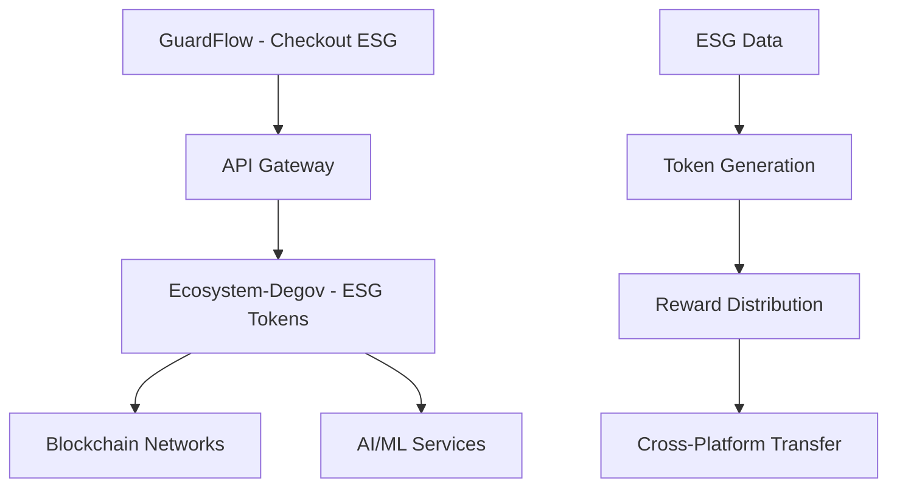

# 🔄 **CORREÇÃO DA MIGRAÇÃO - ESG ECOSYSTEM DATA**

## 📋 **SITUAÇÃO CORRIGIDA**

### **❌ ENTENDIMENTO ANTERIOR (INCORRETO):**
- Pensava que eram "dados do GuardFlow"
- Assumia que eram funcionalidades do sistema de checkout
- Tratava como dados específicos do GuardFlow

### **✅ ENTENDIMENTO CORRETO:**
- **Dados do ESG Token Ecosystem** que estavam no GuardFlow
- **Arquitetura ESG** que foi desenvolvida no repositório errado
- **Código ESG** que deveria estar no Ecosystem-Degov desde o início

---

## 🎯 **O QUE REALMENTE FOI MIGRADO**

### **📁 DADOS ESG TOKEN ECOSYSTEM:**
- ✅ **EAP.md** - Arquitetura empresarial do ESG Token Ecosystem
- ✅ **EAP_ECOSSISTEMA_GUARDFLOW.md** - Arquitetura do ecossistema ESG
- ✅ **src/mobility/** - Código Rust ESG de mobilidade
- ✅ **REORGANIZATION_GUIDE.md** - Guia de reorganização

### **🔍 ANÁLISE CORRETA:**
Estes arquivos **NÃO eram dados do GuardFlow**, mas sim:
- **Documentação ESG** que estava no repositório errado
- **Código ESG** que deveria estar no Ecosystem-Degov
- **Arquitetura ESG** que foi desenvolvida no lugar errado

---

## 🏗️ **ESTRUTURA CORRETA IDENTIFICADA**

### **GuardFlow (Sistema de Checkout):**
```
GuardFlow/
├── backend/ (FastAPI - checkout)
├── guardflow-web/ (React - frontend)
├── mobile-app/ (React Native - mobile)
├── guardflow-sdk/ (Python SDK)
└── README.md (focado em checkout)
```

### **Ecosystem-Degov (ESG Token Backend):**
```
ecosystem-degov/
├── src/ (Rust - ESG tokens)
├── migration_from_guardflow/ (dados ESG migrados)
├── GUARDFLOW_INTEGRATION.md
└── README.md (focado em ESG tokens)
```

---

## 🔗 **INTEGRAÇÃO CORRETA**

### **Fluxo Real:**


### **Responsabilidades Corretas:**
- **GuardFlow**: Sistema de checkout com integração ESG
- **Ecosystem-Degov**: Backend ESG Token com 7 tokens
- **Integração**: API Gateway + Event Bus

---

## 📊 **DADOS ESG MIGRADOS**

### **Arquitetura ESG Token Ecosystem:**
- ✅ **7 Tokens Interconectados** (ECT, ECS, CCR, ECR, EST, EGM, GST)
- ✅ **Blockchain Híbrida** (Privada + Pública)
- ✅ **AI/ML Services** (Computer Vision, NLP, Analytics)
- ✅ **Cross-Platform Integration** (Mobilidade, Varejo, Sustentabilidade)

### **Funcionalidades ESG:**
- ✅ **Tokenização de Métricas ESG**
- ✅ **Gamificação Sustentável**
- ✅ **Marketplace ESG**
- ✅ **Governança Tokenizada**
- ✅ **NFE to NFT Conversion**
- ✅ **Smart Cart Integration**

---

## 🎯 **RESULTADO CORRETO**

### **✅ MIGRAÇÃO ESG CONCLUÍDA:**
- **Dados ESG** movidos do repositório errado
- **Arquitetura ESG** agora no lugar correto
- **Código ESG** integrado ao Ecosystem-Degov
- **Documentação ESG** organizada

### **🔗 INTEGRAÇÃO ESTABELECIDA:**
- **GuardFlow** mantém foco em checkout ESG
- **Ecosystem-Degov** focado em tokenização ESG
- **Comunicação** via API Gateway
- **Dados ESG** unificados

---

## 📚 **DOCUMENTAÇÃO ATUALIZADA**

### **Arquivos Corrigidos:**
- ✅ `MIGRATION_STATUS.md` - Status corrigido
- ✅ `MIGRATION_LOG.md` - Log corrigido
- ✅ `CORRECAO_MIGRACAO.md` - Este arquivo

### **Entendimento Correto:**
- **GuardFlow**: Sistema de checkout ESG
- **Ecosystem-Degov**: Backend ESG Token
- **Migração**: Dados ESG do repositório errado

---

**🔄 Correção da Migração - ESG Ecosystem Data no Lugar Correto! 🌱**

**Status**: ✅ **MIGRAÇÃO ESG CORRIGIDA**  
**Entendimento**: ✅ **CLARIFICADO**  
**Próximo**: 🔗 **INTEGRAÇÃO VIA API**
