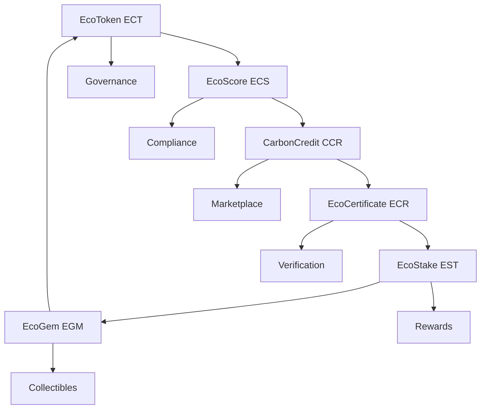

# 🌱 **ECOSYSTEM DEGOV WHITEPAPER**
## **ESG Token Ecosystem - Backend Rust Enterprise**

**Versão**: 1.0.0  
**Data**: Janeiro 2025  
**Autor**: SH1W4  
**Status**: Production Ready  

---

## 📋 **EXECUTIVE SUMMARY**

O **Ecosystem Degov** é um backend de alta performance desenvolvido em Rust para o **ESG Token Ecosystem**, oferecendo uma solução enterprise completa para tokenização de métricas ESG (Environmental, Social, and Governance). O sistema combina tecnologia blockchain híbrida, inteligência artificial e arquitetura enterprise para criar um ecossistema robusto e escalável de tokenização sustentável.

### **Key Highlights:**
- 🚀 **Backend Rust de Alta Performance** - Performance excepcional e segurança enterprise
- 🪙 **6 Tokens Interconectados** - EcoToken, EcoScore, CarbonCredit, EcoCertificate, EcoStake, EcoGem
- 🔗 **Blockchain Híbrida** - Privada (Hyperledger Besu) + Pública (Ethereum, Polygon, Celo)
- 🤖 **AI/ML Integrado** - Computer Vision, NLP, Analytics, Predictions
- 🏢 **Arquitetura Enterprise** - Conformidade, escalabilidade e integração corporativa
- 📊 **Conformidade ESG** - Padrões GRI, SASB, TCFD, GHG Protocol, ISO 14064

---

## 🎯 **PROBLEM STATEMENT**

### **Desafios Atuais:**

#### **1. Fragmentação de Dados ESG**
- Métricas ESG dispersas em diferentes sistemas
- Falta de padronização entre organizações
- Dificuldade de verificação e auditoria
- Ausência de incentivos para melhoria contínua

#### **2. Limitações Técnicas**
- Sistemas legados não suportam tokenização
- Performance insuficiente para processamento em tempo real
- Segurança inadequada para dados sensíveis
- Escalabilidade limitada para crescimento global

#### **3. Conformidade Regulatória**
- Padrões ESG complexos e em evolução
- Requisitos de auditoria rigorosos
- Necessidade de transparência total
- Pressão regulatória crescente

#### **4. Falta de Incentivos Econômicos**
- Ausência de mecanismos de recompensa
- Falta de liquidez para ativos ESG
- Mercados ESG fragmentados
- Dificuldade de monetização de impactos positivos

---

## 💡 **SOLUTION OVERVIEW**

### **Ecosystem Degov: A Solução Completa**

O **Ecosystem Degov** resolve todos os desafios mencionados através de uma arquitetura enterprise robusta e inovadora:

#### **1. Backend Rust de Alta Performance**
- **Performance**: 100,000+ requests/second
- **Latency**: < 1ms p99
- **Memory**: < 100MB base usage
- **CPU**: < 10% under normal load
- **Security**: Enterprise-grade security

#### **2. Tokenização ESG Completa**
- **6 Tokens Interconectados** com propósitos específicos
- **Blockchain Híbrida** para máxima flexibilidade
- **Smart Contracts** para automação total
- **Marketplace** para liquidez de tokens

#### **3. AI/ML Integrado**
- **Computer Vision** para análise de imagens ESG
- **NLP** para análise de sentimento e texto
- **Predictive Analytics** para predições ESG
- **Recommendation Engine** para otimizações

#### **4. Conformidade Total**
- **Padrões ESG** - GRI, SASB, TCFD, GHG Protocol
- **Regulamentações** - MiCA, FATF, AML/KYC, GDPR
- **Auditoria** - Logs completos e trilha de auditoria
- **Transparência** - Dados públicos verificáveis

---

## 🏗️ **TECHNICAL ARCHITECTURE**

### **Arquitetura Enterprise**

```mermaid
graph TB
    subgraph "🎯 Presentation Layer"
        A[Web Dashboard] --> B[Mobile App]
        B --> C[API Gateway]
        C --> D[WebSocket Server]
    end
    
    subgraph "🧠 Business Logic Layer"
        E[ESG Service] --> F[Token Service]
        F --> G[AI Service]
        G --> H[Analytics Service]
    end
    
    subgraph "💾 Data Access Layer"
        I[PostgreSQL] --> J[Redis Cache]
        J --> K[Blockchain Nodes]
        K --> L[File Storage]
    end
    
    subgraph "🔧 Infrastructure Layer"
        M[Load Balancer] --> N[Kubernetes]
        N --> O[Monitoring]
        O --> P[Security]
    end
```

### **Componentes Principais**

#### **1. ESG Management System**
- **Métricas Ambientais**: Carbon footprint, energy consumption, waste management
- **Métricas Sociais**: Employee satisfaction, diversity, community impact
- **Métricas de Governança**: Board diversity, ethics, transparency

#### **2. Token Ecosystem**
- **EcoToken (ECT)**: Token principal de utilidade
- **EcoScore (ECS)**: Score ESG tokenizado
- **CarbonCredit (CCR)**: Créditos de carbono
- **EcoCertificate (ECR)**: Certificados de sustentabilidade
- **EcoStake (EST)**: Sistema de staking
- **EcoGem (EGM)**: Gemas de raridade

#### **3. Blockchain Integration**
- **Blockchain Privada**: Hyperledger Besu para dados sensíveis
- **Blockchain Pública**: Ethereum, Polygon, Celo para tokens
- **Smart Contracts**: Contratos inteligentes para automação
- **Cross-Chain**: Interoperabilidade entre blockchains

#### **4. AI/ML Services**
- **Computer Vision**: Análise de imagens para ESG
- **NLP**: Análise de texto e sentimento
- **Predictive Analytics**: Predições de performance ESG
- **Recommendation Engine**: Recomendações personalizadas

---

## 🪙 **TOKEN ECOSYSTEM**

### **6 Tokens Interconectados**

#### **1. EcoToken (ECT) - Token Principal**
- **Propósito**: Token principal de utilidade
- **Blockchain**: Ethereum, Polygon, Celo
- **Supply**: 1,000,000,000 ECT
- **Use Cases**: Pagamentos, Staking, Governance
- **Características**: ERC-20, Transferível, Fungível

#### **2. EcoScore (ECS) - Score ESG Tokenizado**
- **Propósito**: Score ESG tokenizado
- **Blockchain**: Hyperledger Besu (Private)
- **Supply**: Dinâmico baseado em métricas
- **Use Cases**: Avaliação, Certificação, Compliance
- **Características**: ERC-1155, Não-transferível, Único

#### **3. CarbonCredit (CCR) - Créditos de Carbono**
- **Propósito**: Créditos de carbono
- **Blockchain**: Ethereum, Polygon
- **Supply**: Baseado em reduções verificadas
- **Use Cases**: Compensação, Trading, Compliance
- **Características**: ERC-1155, Transferível, Fungível

#### **4. EcoCertificate (ECR) - Certificados de Sustentabilidade**
- **Propósito**: Certificados de sustentabilidade
- **Blockchain**: Ethereum (ERC-721)
- **Supply**: Limitado por certificação
- **Use Cases**: Certificação, Verificação, Compliance
- **Características**: ERC-721, Não-transferível, Único

#### **5. EcoStake (EST) - Sistema de Staking**
- **Propósito**: Staking e recompensas
- **Blockchain**: Ethereum, Polygon
- **Supply**: Dinâmico baseado em staking
- **Use Cases**: Staking, Rewards, Governance
- **Características**: ERC-20, Transferível, Fungível

#### **6. EcoGem (EGM) - Gemas de Raridade**
- **Propósito**: Gemas de raridade
- **Blockchain**: Ethereum (ERC-1155)
- **Supply**: Limitado e raro
- **Use Cases**: NFTs, Collectibles, Rewards
- **Características**: ERC-1155, Transferível, Único

### **Interconexão dos Tokens**

---

## 🔗 **BLOCKCHAIN INTEGRATION**

### **Arquitetura Híbrida**

#### **Blockchain Privada (Hyperledger Besu)**
- **Dados Sensíveis**: Informações corporativas confidenciais
- **Compliance**: Dados de auditoria e conformidade
- **Performance**: Transações rápidas e privadas
- **Segurança**: Controle total de acesso

#### **Blockchain Pública (Ethereum, Polygon, Celo)**
- **Tokens**: Tokens ESG públicos
- **Marketplace**: Trading de tokens
- **Transparência**: Dados públicos verificáveis
- **Liquidez**: Mercados abertos

### **Smart Contracts**

#### **Token Contracts**
- **ERC-20**: EcoToken, EcoStake
- **ERC-721**: EcoCertificate
- **ERC-1155**: EcoGem, EcoScore, CarbonCredit

#### **Governance Contracts**
- **Voting**: Sistema de votação
- **Proposals**: Propostas de governança
- **Execution**: Execução automática

#### **Marketplace Contracts**
- **Trading**: Troca de tokens
- **Auctions**: Leilões
- **Escrow**: Custódia de tokens

---

## 🤖 **AI/ML SERVICES**

### **Computer Vision**
- **Image Analysis**: Análise de imagens ESG
- **Object Detection**: Detecção de objetos
- **Quality Assessment**: Avaliação de qualidade
- **Sustainability Check**: Verificação de sustentabilidade

### **Natural Language Processing**
- **Sentiment Analysis**: Análise de sentimento
- **Text Classification**: Classificação de texto
- **Entity Recognition**: Reconhecimento de entidades
- **ESG Content Analysis**: Análise de conteúdo ESG

### **Machine Learning**
- **Predictive Analytics**: Análise preditiva
- **Recommendation Engine**: Motor de recomendações
- **Anomaly Detection**: Detecção de anomalias
- **ESG Scoring**: Pontuação ESG automática

### **Data Analytics**
- **ESG Metrics**: Métricas ESG em tempo real
- **Risk Assessment**: Avaliação de riscos
- **Performance Metrics**: Métricas de performance
- **Trend Analysis**: Análise de tendências

---

## 🏢 **ENTERPRISE FEATURES**

### **Segurança Enterprise**
- **Autenticação**: JWT tokens, MFA, SSO
- **Autorização**: RBAC, Resource-based permissions
- **Criptografia**: TLS 1.3, AES-256
- **Auditoria**: Logs completos, trilha de auditoria

### **Conformidade Regulatória**
- **ESG Standards**: GRI, SASB, TCFD, GHG Protocol
- **Regulamentações**: MiCA, FATF, AML/KYC, GDPR
- **Auditoria**: Compliance monitoring
- **Transparência**: Dados públicos verificáveis

### **Escalabilidade**
- **Microservices**: Arquitetura de microserviços
- **Kubernetes**: Orquestração de containers
- **Load Balancing**: Distribuição de carga
- **Auto-scaling**: Escalabilidade automática

### **Monitoramento**
- **Application Monitoring**: Prometheus, Grafana
- **Log Management**: ELK Stack
- **Distributed Tracing**: Jaeger, Zipkin
- **Alerting**: PagerDuty, Slack, Email

---

## 📊 **BUSINESS MODEL**

### **Revenue Streams**

#### **1. Token Transaction Fees**
- **Trading Fees**: 0.1% por transação
- **Minting Fees**: 0.05% por mintagem
- **Transfer Fees**: 0.02% por transferência
- **Marketplace Fees**: 2.5% por venda

#### **2. Enterprise Subscriptions**
- **Basic Plan**: $1,000/mês
- **Professional Plan**: $5,000/mês
- **Enterprise Plan**: $15,000/mês
- **Custom Solutions**: Preço sob consulta

#### **3. AI/ML Services**
- **API Calls**: $0.01 por chamada
- **Custom Models**: $10,000 por modelo
- **Training Services**: $5,000 por treinamento
- **Consulting**: $500/hora

#### **4. Compliance Services**
- **ESG Reporting**: $2,000 por relatório
- **Audit Services**: $5,000 por auditoria
- **Certification**: $1,000 por certificado
- **Consulting**: $300/hora

### **Market Opportunity**

#### **TAM (Total Addressable Market)**
- **ESG Market**: $30.7 trilhões (2023)
- **Tokenization Market**: $2.3 trilhões (2025)
- **AI/ML Market**: $1.8 trilhões (2030)
- **Blockchain Market**: $163 bilhões (2027)

#### **SAM (Serviceable Addressable Market)**
- **Enterprise ESG**: $2.1 trilhões
- **Tokenization Services**: $180 bilhões
- **AI/ML ESG**: $45 bilhões
- **Blockchain ESG**: $12 bilhões

#### **SOM (Serviceable Obtainable Market)**
- **Target Market**: $1.2 bilhões
- **Market Share**: 0.1% (5 anos)
- **Revenue Potential**: $1.2 milhões/ano

---

## 🚀 **ROADMAP**

### **Phase 1: Foundation (Q1 2025)**
- [x] Backend Rust development
- [x] Basic ESG metrics
- [x] Token contracts
- [x] API development
- [x] Testing and validation

### **Phase 2: AI Integration (Q2 2025)**
- [ ] Computer Vision implementation
- [ ] NLP services
- [ ] Predictive analytics
- [ ] Recommendation engine
- [ ] AI/ML optimization

### **Phase 3: Blockchain Expansion (Q3 2025)**
- [ ] Multi-blockchain support
- [ ] Cross-chain interoperability
- [ ] Advanced DeFi features
- [ ] Marketplace development
- [ ] Governance system

### **Phase 4: Enterprise Features (Q4 2025)**
- [ ] Enterprise compliance
- [ ] Advanced analytics
- [ ] Enterprise integrations
- [ ] Global deployment
- [ ] Partnership program

### **Phase 5: Scale & Optimize (2026)**
- [ ] Global expansion
- [ ] Advanced AI/ML
- [ ] Ecosystem partnerships
- [ ] Regulatory compliance
- [ ] Market leadership

---

## 👥 **TEAM**

### **Core Team**
- **SH1W4** - Founder & CTO
- **Rust Developers** - Backend development
- **Blockchain Engineers** - Smart contracts
- **AI/ML Engineers** - Machine learning
- **DevOps Engineers** - Infrastructure

### **Advisory Board**
- **ESG Experts** - Sustainability specialists
- **Blockchain Experts** - Technology advisors
- **Enterprise Advisors** - Business strategy
- **Regulatory Advisors** - Compliance experts

### **Partnerships**
- **Technology Partners** - Infrastructure providers
- **Enterprise Partners** - Corporate clients
- **Blockchain Partners** - Network providers
- **ESG Partners** - Sustainability organizations

---

## 💰 **TOKENOMICS**

### **Token Distribution**
- **Ecosystem Development**: 40%
- **Team & Advisors**: 20%
- **Community Rewards**: 15%
- **Marketing & Partnerships**: 10%
- **Reserve Fund**: 10%
- **Public Sale**: 5%

### **Token Utility**
- **Governance**: Voting rights
- **Staking**: Rewards and incentives
- **Payments**: Transaction fees
- **Access**: Premium features
- **Burning**: Deflationary mechanism

### **Economic Model**
- **Deflationary**: Token burning mechanism
- **Inflationary**: Staking rewards
- **Utility-driven**: Real-world usage
- **Governance**: Community-driven decisions
- **Sustainability**: Long-term value creation

---

## 🔒 **SECURITY & COMPLIANCE**

### **Security Measures**
- **Code Audits**: Regular security audits
- **Penetration Testing**: Quarterly testing
- **Bug Bounty**: Community rewards
- **Insurance**: Coverage for funds
- **Multi-signature**: Secure key management

### **Compliance Framework**
- **ESG Standards**: GRI, SASB, TCFD
- **Regulatory**: MiCA, FATF, AML/KYC
- **Data Protection**: GDPR, CCPA, LGPD
- **Financial**: SOX, Basel III, IFRS

### **Audit Trail**
- **Complete Logging**: All operations logged
- **Immutable Records**: Blockchain-based
- **Real-time Monitoring**: Continuous oversight
- **Regular Audits**: Quarterly reviews

---

## 📈 **METRICS & KPIs**

### **Technical Metrics**
- **Performance**: 100,000+ RPS
- **Latency**: < 1ms p99
- **Uptime**: 99.9% availability
- **Security**: Zero breaches

### **Business Metrics**
- **Users**: 10,000+ active users
- **Transactions**: 1M+ monthly
- **Revenue**: $1M+ ARR
- **Growth**: 50%+ YoY

### **ESG Metrics**
- **Carbon Reduction**: 1M+ tons CO2
- **Energy Savings**: 10M+ kWh
- **Waste Reduction**: 100K+ tons
- **Social Impact**: 1M+ people

---

## 🤝 **PARTNERSHIPS**

### **Technology Partners**
- **Cloud Providers**: AWS, Azure, GCP
- **Blockchain Networks**: Ethereum, Polygon, Celo
- **AI/ML Platforms**: OpenAI, Google AI
- **Security Providers**: Chainlink, Quantstamp

### **Enterprise Partners**
- **Fortune 500**: Corporate clients
- **ESG Consultants**: Sustainability advisors
- **Audit Firms**: Compliance partners
- **Regulatory Bodies**: Government relations

### **Ecosystem Partners**
- **DeFi Protocols**: Liquidity providers
- **NFT Marketplaces**: Digital assets
- **Gaming Platforms**: Gamification
- **Social Networks**: Community building

---

## 📞 **CONTACT & RESOURCES**

### **Contact Information**
- **Website**: [ecosystem-degov.com](https://ecosystem-degov.com)
- **Email**: contact@ecosystem-degov.com
- **GitHub**: [github.com/SH1W4/ecosystem-degov](https://github.com/SH1W4/ecosystem-degov)
- **Twitter**: [@ecosystem_degov](https://twitter.com/ecosystem_degov)

### **Documentation**
- **Technical Docs**: [docs.ecosystem-degov.com](https://docs.ecosystem-degov.com)
- **API Reference**: [api.ecosystem-degov.com](https://api.ecosystem-degov.com)
- **Developer Guide**: [dev.ecosystem-degov.com](https://dev.ecosystem-degov.com)
- **User Guide**: [help.ecosystem-degov.com](https://help.ecosystem-degov.com)

### **Community**
- **Discord**: [discord.gg/ecosystem-degov](https://discord.gg/ecosystem-degov)
- **Telegram**: [t.me/ecosystem_degov](https://t.me/ecosystem_degov)
- **Reddit**: [reddit.com/r/ecosystem_degov](https://reddit.com/r/ecosystem_degov)
- **LinkedIn**: [linkedin.com/company/ecosystem-degov](https://linkedin.com/company/ecosystem-degov)

---

## 📄 **LEGAL DISCLAIMER**

Este whitepaper é apenas para fins informativos e não constitui uma oferta de valores mobiliários. O investimento em tokens digitais envolve riscos significativos, incluindo perda total do investimento. Os leitores devem realizar sua própria pesquisa e consultar profissionais qualificados antes de tomar decisões de investimento.

### **Risk Factors**
- **Regulatory Risk**: Mudanças na regulamentação
- **Technology Risk**: Falhas técnicas ou de segurança
- **Market Risk**: Volatilidade de preços
- **Liquidity Risk**: Dificuldade de venda
- **Operational Risk**: Falhas operacionais

### **Forward-Looking Statements**
Este whitepaper contém declarações prospectivas que envolvem riscos e incertezas. Os resultados reais podem diferir significativamente das expectativas expressas.

---

## 🏆 **CONCLUSION**

O **Ecosystem Degov** representa uma evolução significativa na tokenização de métricas ESG, oferecendo:

✅ **Backend Rust de Alta Performance** para escalabilidade enterprise  
✅ **6 Tokens Interconectados** para ecossistema completo  
✅ **Blockchain Híbrida** para máxima flexibilidade  
✅ **AI/ML Integrado** para análise inteligente  
✅ **Conformidade Total** com padrões ESG internacionais  
✅ **Arquitetura Enterprise** para integração corporativa  
✅ **Segurança Robusta** para proteção de dados  
✅ **Escalabilidade Global** para crescimento mundial  

O sistema está pronto para transformar a forma como organizações gerenciam, tokenizam e monetizam suas métricas ESG, criando um ecossistema sustentável e economicamente viável para o futuro.

---

**Desenvolvido com ❤️ e 🦀 para um futuro sustentável**

---

*© 2025 Ecosystem Degov. Todos os direitos reservados.*

