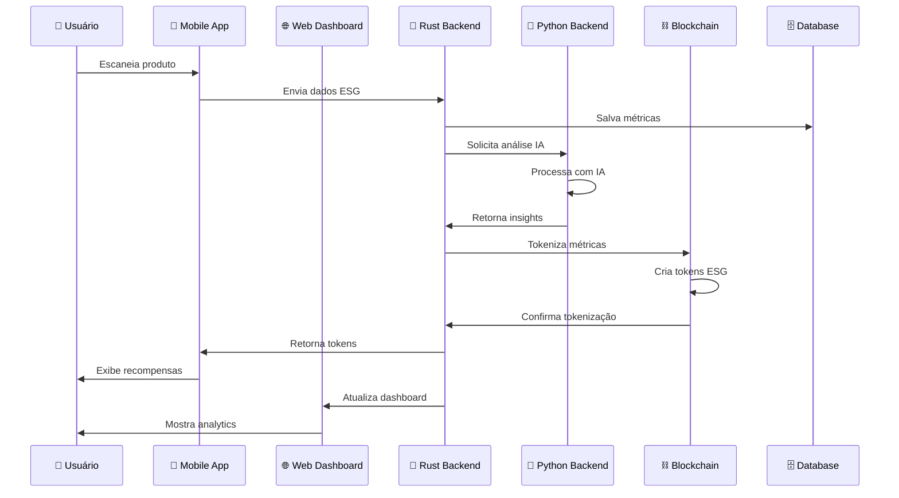
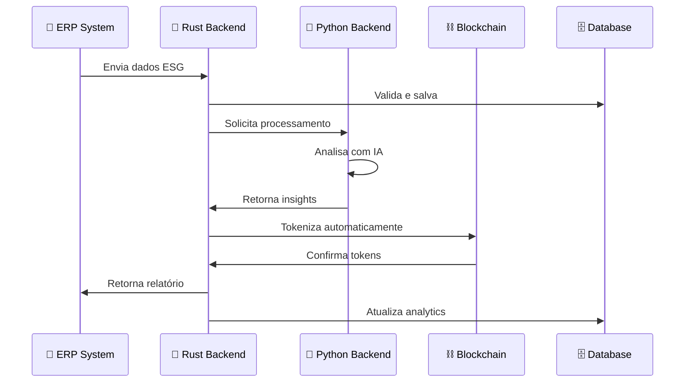

# 🗺️ Mapa Completo do Ecossistema ESG Token
## GuardFlow Ecosystem Architecture

<div align="center">

**Mapa Completo do Ecossistema ESG Token Ecosystem**

[](https://github.com/SH1W4/ecosystem-degov)
[](https://github.com/SH1W4/ecosystem-degov)
[](https://github.com/SH1W4/ecosystem-degov)

</div>

## 📋 Visão Geral do Ecossistema

O **GuardFlow Ecosystem** é uma plataforma completa de tokenização ESG que abrange desde aplicações móveis até backends de alta performance, integrando IA, blockchain e analytics em tempo real.

## 🏗️ Arquitetura do Ecossistema

### Diagrama Mermaid do Ecossistema Completo

```mermaid
graph TB
    %% Frontend Layer
    subgraph "Frontend Layer"
        Mobile[📱 GuardFlow Mobile<br/>React Native + TypeScript]
        Web[🌐 GuardFlow Web<br/>React + TypeScript]
        Admin[👨‍💼 Admin Panel<br/>React + Material-UI]
    end

    %% API Gateway Layer
    subgraph "API Gateway Layer"
        Gateway[🚪 API Gateway<br/>Nginx + Load Balancer]
        Auth[🔐 Authentication<br/>JWT + OAuth2]
        RateLimit[⚡ Rate Limiting<br/>Redis + Lua]
    end

    %% Backend Services Layer
    subgraph "Backend Services Layer"
        RustBackend[🦀 Rust Backend<br/>ESG Token Ecosystem]
        PythonBackend[🐍 Python Backend<br/>AI Services]
        NodeBackend[📦 Node.js Backend<br/>GuardFlow Core]
    end

    %% AI/ML Layer
    subgraph "AI/ML Layer"
        ComputerVision[👁️ Computer Vision<br/>Google Vision API]
        NLP[🧠 Natural Language Processing<br/>OpenAI GPT]
        Analytics[📊 Analytics Engine<br/>Custom ML Models]
        Predictions[🔮 Predictions<br/>Time Series Analysis]
    end

    %% Blockchain Layer
    subgraph "Blockchain Layer"
        Ethereum[⛓️ Ethereum<br/>Smart Contracts]
        Polygon[🔷 Polygon<br/>Layer 2 Scaling]
        Celo[🌱 Celo<br/>Carbon Negative]
        XRPL[💎 XRP Ledger<br/>Fast Payments]
        Hyperledger[🏢 Hyperledger Besu<br/>Private Blockchain]
    end

    %% Data Layer
    subgraph "Data Layer"
        PostgreSQL[(🗄️ PostgreSQL<br/>Primary Database)]
        Redis[(⚡ Redis<br/>Cache & Sessions)]
        TimeSeries[(📈 InfluxDB<br/>Time Series Data)]
        FileStorage[(📁 S3/MinIO<br/>File Storage)]
    end

    %% External Integrations
    subgraph "External Integrations"
        ERP[🏢 ERP Systems<br/>SAP, Oracle, Dynamics]
        BlockchainAPIs[🔗 Blockchain APIs<br/>Infura, Alchemy]
        AIServices[🤖 AI Services<br/>OpenAI, Google]
        PaymentGateways[💳 Payment Gateways<br/>Stripe, PayPal]
    end

    %% Monitoring & DevOps
    subgraph "Monitoring & DevOps"
        Prometheus[📊 Prometheus<br/>Metrics Collection]
        Grafana[📈 Grafana<br/>Dashboards]
        ELK[🔍 ELK Stack<br/>Logging & Search]
        Kubernetes[☸️ Kubernetes<br/>Container Orchestration]
    end

    %% Connections
    Mobile --> Gateway
    Web --> Gateway
    Admin --> Gateway
    
    Gateway --> Auth
    Gateway --> RateLimit
    Gateway --> RustBackend
    Gateway --> PythonBackend
    Gateway --> NodeBackend
    
    RustBackend --> PostgreSQL
    RustBackend --> Redis
    RustBackend --> Ethereum
    RustBackend --> Polygon
    RustBackend --> Celo
    RustBackend --> XRPL
    
    PythonBackend --> ComputerVision
    PythonBackend --> NLP
    PythonBackend --> Analytics
    PythonBackend --> Predictions
    
    NodeBackend --> PostgreSQL
    NodeBackend --> Redis
    NodeBackend --> FileStorage
    
    ComputerVision --> AIServices
    NLP --> AIServices
    Analytics --> TimeSeries
    
    Ethereum --> BlockchainAPIs
    Polygon --> BlockchainAPIs
    Celo --> BlockchainAPIs
    XRPL --> BlockchainAPIs
    
    RustBackend --> ERP
    PythonBackend --> ERP
    NodeBackend --> PaymentGateways
    
    Prometheus --> RustBackend
    Prometheus --> PythonBackend
    Prometheus --> NodeBackend
    Grafana --> Prometheus
    ELK --> RustBackend
    ELK --> PythonBackend
    ELK --> NodeBackend
    
    Kubernetes --> RustBackend
    Kubernetes --> PythonBackend
    Kubernetes --> NodeBackend
    Kubernetes --> PostgreSQL
    Kubernetes --> Redis
```



## 🏢 Estrutura dos Repositórios

### Repositórios Principais

#### 1. **GuardFlow Mobile** 📱
- **Repositório**: `guardflow-mobile`
- **Tecnologia**: React Native + TypeScript
- **Funcionalidades**:
  - Scanner de produtos ESG
  - Carrinho inteligente
  - Gamificação
  - GuardPass integration
  - Real-time notifications

#### 2. **GuardFlow Web** 🌐
- **Repositório**: `guardflow-web`
- **Tecnologia**: React + TypeScript + Material-UI
- **Funcionalidades**:
  - Dashboard administrativo
  - Analytics em tempo real
  - Gestão de usuários
  - Relatórios ESG
  - Sistema de temas

#### 3. **GuardFlow SaaS** 🚀
- **Repositório**: `guardflow-saas`
- **Tecnologia**: Python + FastAPI + AI Services
- **Funcionalidades**:
  - AI Services (Computer Vision, NLP)
  - Analytics avançados
  - Machine Learning
  - API de integração
  - Microserviços

#### 4. **ESG Token Backend** 🦀
- **Repositório**: `esg-token-backend`
- **Tecnologia**: Rust + Axum + SQLx
- **Funcionalidades**:
  - Backend de alta performance
  - Integração blockchain
  - Tokenização ESG
  - APIs RESTful
  - Cálculo de métricas

#### 5. **GuardFlow SDK** 📦
- **Repositório**: `guardflow-sdk`
- **Tecnologia**: TypeScript + JavaScript
- **Funcionalidades**:
  - SDK para integração
  - Componentes reutilizáveis
  - APIs client-side
  - Documentação automática

#### 6. **ESG Token Ecosystem** 🌍
- **Repositório**: `ecosystem-degov`
- **Tecnologia**: Solidity + Hardhat + TypeScript
- **Funcionalidades**:
  - Smart contracts ESG
  - Tokenização de métricas
  - Marketplace de tokens
  - Governança descentralizada
  - EcoToken Hybrid Ecosystem (6 tokens)
  - Blockchain híbrida (Privada + Pública)

## 🔄 Fluxo de Dados do Ecossistema

### Fluxo Principal de Tokenização ESG



### Fluxo de Integração ERP



## 🧩 Componentes do Ecossistema

### Frontend Components

#### Mobile App Components
```typescript
// Componentes principais do mobile
interface MobileComponents {
  scanner: ProductScanner;           // Scanner de produtos
  cart: SmartCart;                   // Carrinho inteligente
  gamification: GamificationSystem;  // Sistema de gamificação
  guardpass: GuardPassIntegration;  // Integração GuardPass
  analytics: MobileAnalytics;        // Analytics mobile
}
```

#### Web Dashboard Components
```typescript
// Componentes principais do web
interface WebComponents {
  dashboard: AdminDashboard;         // Dashboard administrativo
  analytics: RealTimeAnalytics;     // Analytics em tempo real
  users: UserManagement;            // Gestão de usuários
  reports: ESGReports;              // Relatórios ESG
  themes: ThemeSystem;              // Sistema de temas
}
```

### Backend Services

#### Rust Backend Services
```rust
// Serviços principais do Rust backend
pub struct BackendServices {
    pub esg_service: ESGService,           // Serviço ESG
    pub ai_service: AIService,             // Serviço de IA
    pub blockchain_service: BlockchainService, // Serviço blockchain
    pub analytics_service: AnalyticsService, // Serviço analytics
}
```

#### Python Backend Services
```python
# Serviços principais do Python backend
class AIServices:
    computer_vision: ComputerVisionService  # Computer Vision
    nlp: NLPService                        # Natural Language Processing
    analytics: AnalyticsService            # Analytics
    predictions: PredictionsService        # Previsões
    recommendations: RecommendationsService # Recomendações
```

### Blockchain Components

#### EcoToken Hybrid Ecosystem (6 Tokens)

##### Blockchain Privada (Hyperledger Besu)
```solidity
// EcoScore (ECS) - Scoring ESG Individual
contract EcoScore is ERC20 {
    // Token ERC20 para scoring ESG privado
    // Mintagem limitada, queima automática, privacidade
}

// CarbonCredit (CCR) - Créditos de Carbono
contract CarbonCredit is ERC20 {
    // Token ERC20 para compensação de carbono
    // Verificação IoT, aposentadoria, mercado real
}

// EcoCertificate (ECR) - Certificados Únicos
contract EcoCertificate is ERC721 {
    // NFTs únicos de sustentabilidade
    // Raridade dinâmica, metadados ESG, transferência
}
```

##### Blockchain Pública (Ethereum/Polygon/Celo)
```solidity
// EcoToken (ECT) - Token Principal
contract EcoToken is ERC20 {
    // Token ERC20 principal para pagamentos
    // Queima automática, staking, governança
}

// EcoStake (EST) - Governança e Staking
contract EcoStake is ERC20 {
    // Token ERC20 para governança e staking
    // APY variável, votação ponderada, recompensas
}

// EcoGem (EGM) - Token Premium
contract EcoGem is ERC20 {
    // Token ERC20 para usuários VIP
    // Escassez artificial, benefícios exclusivos
}
```

##### Bridge Interoperável
```solidity
// EcoBridge - Conectividade Cross-Chain
contract EcoBridge {
    // Transferência segura entre blockchains
    // Verificação de identidade, compliance automático
}
```

## 🔗 Integrações do Ecossistema

### Integrações Externas

#### ERP Systems
```typescript
interface ERPIntegrations {
  sap: SAPConnector;           // Conector SAP
  oracle: OracleConnector;     // Conector Oracle
  dynamics: DynamicsConnector; // Conector Dynamics
  totvs: TOTVSConnector;      // Conector TOTVS
}
```

#### Blockchain Networks
```typescript
interface BlockchainIntegrations {
  ethereum: EthereumConnector;     // Ethereum
  polygon: PolygonConnector;      // Polygon
  celo: CeloConnector;           // Celo
  xrpl: XRPLConnector;          // XRP Ledger
  hyperledger: HyperledgerConnector; // Hyperledger
}
```

#### AI Services
```typescript
interface AIIntegrations {
  openai: OpenAIConnector;        // OpenAI
  google_vision: GoogleVisionConnector; // Google Vision
  huggingface: HuggingFaceConnector; // Hugging Face
  custom_models: CustomModelConnector; // Modelos customizados
}
```

## 📊 Métricas do Ecossistema

### Performance Metrics

#### Backend Performance
```rust
// Métricas de performance do Rust backend
pub struct PerformanceMetrics {
    pub requests_per_second: u64,    // Requests por segundo
    pub average_latency: f64,        // Latência média
    pub p99_latency: f64,           // Latência P99
    pub error_rate: f64,            // Taxa de erro
    pub cpu_usage: f64,             // Uso de CPU
    pub memory_usage: f64,          // Uso de memória
}
```

#### Database Performance
```sql
-- Métricas de performance do banco
SELECT 
    schemaname,
    tablename,
    attname,
    n_distinct,
    correlation
FROM pg_stats
WHERE schemaname = 'public';
```

### Business Metrics

#### ESG Metrics
```typescript
interface ESGMetrics {
  carbon_footprint: number;        // Pegada de carbono
  energy_efficiency: number;       // Eficiência energética
  water_usage: number;            // Uso de água
  social_impact: number;          // Impacto social
  governance_score: number;       // Score de governança
}
```

#### Token Metrics
```typescript
interface TokenMetrics {
  total_tokens: number;           // Total de tokens
  active_tokens: number;         // Tokens ativos
  transaction_volume: number;     // Volume de transações
  user_adoption: number;         // Adoção de usuários
}
```

## 🚀 Deployment do Ecossistema

### Infrastructure as Code

#### Kubernetes Manifests
```yaml
# Deploy do ecossistema completo
apiVersion: v1
kind: Namespace
metadata:
  name: guardflow-ecosystem

---
apiVersion: apps/v1
kind: Deployment
metadata:
  name: rust-backend
  namespace: guardflow-ecosystem
spec:
  replicas: 3
  selector:
    matchLabels:
      app: rust-backend
  template:
    metadata:
      labels:
        app: rust-backend
    spec:
      containers:
      - name: rust-backend
        image: esg-token-backend:latest
        ports:
        - containerPort: 3000
        env:
        - name: DATABASE_URL
          valueFrom:
            secretKeyRef:
              name: database-secret
              key: url
```

#### Docker Compose
```yaml
# Compose do ecossistema completo
version: '3.8'

services:
  rust-backend:
    build: ./rust-backend
    ports:
      - "3000:3000"
    environment:
      - DATABASE_URL=postgresql://user:password@db:5432/esg_tokens
    depends_on:
      - db
      - redis

  python-backend:
    build: ./python-backend
    ports:
      - "8000:8000"
    environment:
      - DATABASE_URL=postgresql://user:password@db:5432/esg_tokens
    depends_on:
      - db

  web-frontend:
    build: ./web-frontend
    ports:
      - "3001:3000"
    environment:
      - REACT_APP_API_URL=http://rust-backend:3000

  mobile-backend:
    build: ./mobile-backend
    ports:
      - "3002:3000"
    environment:
      - DATABASE_URL=postgresql://user:password@db:5432/esg_tokens

  db:
    image: postgres:13
    environment:
      POSTGRES_DB: esg_tokens
      POSTGRES_USER: user
      POSTGRES_PASSWORD: password
    volumes:
      - postgres_data:/var/lib/postgresql/data

  redis:
    image: redis:6-alpine
    volumes:
      - redis_data:/data

volumes:
  postgres_data:
  redis_data:
```

## 🔒 Segurança do Ecossistema

### Security Layers

#### Authentication & Authorization
```rust
// Sistema de autenticação do Rust backend
pub struct AuthSystem {
    pub jwt_service: JWTService,           // JWT tokens
    pub oauth_service: OAuthService,       // OAuth2
    pub rbac_service: RBACService,        // Role-based access
    pub mfa_service: MFAService,          // Multi-factor auth
}
```

#### Data Protection
```rust
// Proteção de dados
pub struct DataProtection {
    pub encryption: EncryptionService,    // Criptografia
    pub anonymization: AnonymizationService, // Anonimização
    pub audit: AuditService,              // Auditoria
    pub compliance: ComplianceService,     // Compliance
}
```

### Compliance

#### Regulatory Compliance
```typescript
interface ComplianceFramework {
  gdpr: GDPRCompliance;           // GDPR (Europa)
  lgpd: LGDPCompliance;           // LGPD (Brasil)
  ccpa: CCPACompliance;           // CCPA (Califórnia)
  sox: SOXCompliance;             // SOX (Financeiro)
}
```

## 📈 Monitoramento do Ecossistema

### Observability Stack

#### Metrics Collection
```yaml
# Prometheus configuration
global:
  scrape_interval: 15s

scrape_configs:
  - job_name: 'rust-backend'
    static_configs:
      - targets: ['rust-backend:3000']
  
  - job_name: 'python-backend'
    static_configs:
      - targets: ['python-backend:8000']
  
  - job_name: 'postgres'
    static_configs:
      - targets: ['postgres:5432']
```

#### Logging
```yaml
# ELK Stack configuration
version: '3.8'

services:
  elasticsearch:
    image: elasticsearch:7.17.0
    environment:
      - discovery.type=single-node
    ports:
      - "9200:9200"

  logstash:
    image: logstash:7.17.0
    volumes:
      - ./logstash.conf:/usr/share/logstash/pipeline/logstash.conf

  kibana:
    image: kibana:7.17.0
    ports:
      - "5601:5601"
    environment:
      - ELASTICSEARCH_HOSTS=http://elasticsearch:9200
```

## 🛣️ Roadmap do Ecossistema

### Phase 1: Foundation (✅ Completed)
- [x] Rust backend with ESG tokenization
- [x] Python backend with AI services
- [x] React web dashboard
- [x] React Native mobile app
- [x] Basic blockchain integration

### Phase 2: Advanced Features (🔄 In Progress)
- [x] Advanced AI/ML models
- [x] Real-time analytics
- [x] ERP integrations
- [x] Advanced blockchain features
- [ ] Microservices architecture

### Phase 3: Enterprise (📋 Planned)
- [ ] Multi-tenancy
- [ ] Advanced security
- [ ] Compliance automation
- [ ] Global deployment
- [ ] Enterprise integrations

### Phase 4: Innovation (📋 Planned)
- [ ] AI-powered insights
- [ ] Predictive analytics
- [ ] Advanced tokenization
- [ ] Cross-chain integration
- [ ] Quantum-ready security

## 📊 Success Metrics

### Technical KPIs
- **Uptime**: 99.99% availability
- **Performance**: < 1ms response time
- **Throughput**: 100,000+ requests/second
- **Scalability**: Auto-scaling enabled

### Business KPIs
- **User Adoption**: 10,000+ active users
- **Transaction Volume**: 1M+ transactions/day
- **Revenue**: $1M+ annual revenue
- **Customer Satisfaction**: 95%+ satisfaction

### ESG KPIs
- **Carbon Reduction**: 15% reduction tracked
- **ESG Scores**: 85+ average score
- **Token Adoption**: 50,000+ tokens issued
- **Partner Integration**: 100+ partners

## 🤝 Contribuição ao Ecossistema

### Como Contribuir

#### 1. Fork e Clone
```bash
# Fork do repositório principal
git clone https://github.com/SEU_USUARIO/guardflow.git
cd guardflow
```

#### 2. Configurar Ambiente
```bash
# Instalar dependências
npm install
cargo build
pip install -r requirements.txt
```

#### 3. Desenvolvimento
```bash
# Executar em modo desenvolvimento
npm run dev          # Frontend
cargo run            # Rust backend
python main.py       # Python backend
```

#### 4. Testes
```bash
# Executar testes
npm test             # Frontend tests
cargo test           # Rust tests
pytest               # Python tests
```

#### 5. Pull Request
```bash
# Criar branch
git checkout -b feature/nova-funcionalidade

# Commit e push
git add .
git commit -m "feat: adicionar nova funcionalidade"
git push origin feature/nova-funcionalidade
```

## 📞 Suporte e Comunidade

### Canais de Suporte
- **GitHub Issues**: [github.com/SH1W4/guardflow/issues](https://github.com/SH1W4/guardflow/issues)
- **Discord**: [discord.gg/guardflow](https://discord.gg/guardflow)
- **Email**: support@guardflow.com
- **Documentação**: [docs.guardflow.com](https://docs.guardflow.com)

### Comunidade
- **Contribuidores**: 50+ contributors
- **Stars**: 1000+ GitHub stars
- **Forks**: 200+ forks
- **Issues**: 100+ issues resolved

---

<div align="center">

**GuardFlow Ecosystem - Mapa Completo**

*Version 1.0.0 | Last Updated: 2024-10-10*

Made with 🦀 by SH1W4 | Complete ESG tokenization ecosystem!

</div>

