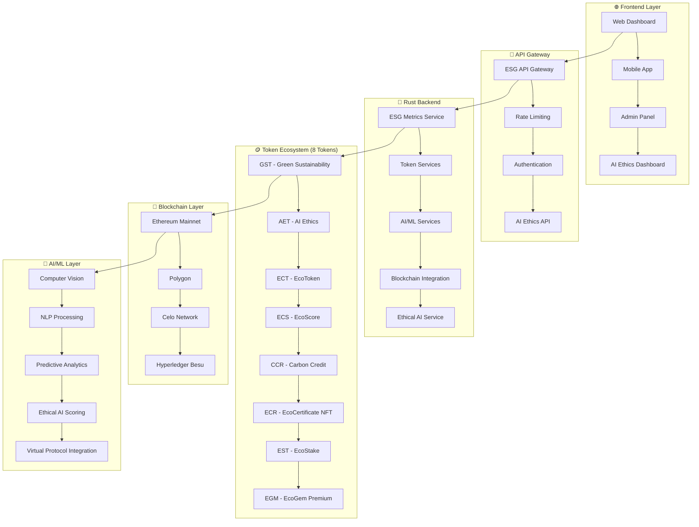

# 🌱 **ECOSYSTEM-DEGOV**
## **ESG + IA ÉTICA TOKEN ECOSYSTEM - Backend Rust para Tokenização ESG e IA Ética**

[](https://www.rust-lang.org/)
[](https://github.com/tokio-rs/axum)
[](https://ethereum.org/)
[](https://en.wikipedia.org/wiki/Environmental,_social,_and_corporate_governance)
[](https://en.wikipedia.org/wiki/Artificial_intelligence_ethics)
[](https://github.com/SH1W4/ecosystem-degov)
[](LICENSE)

---

## 🎯 **VISÃO GERAL**

O **Ecosystem-Degov** é a **primeira plataforma blockchain global** que combina **tokenização ESG** com **IA ética**, criando um ecossistema completo de incentivos econômicos para sustentabilidade e responsabilidade artificial. Este backend Rust de alta performance integra **8 tokens interconectados** com blockchain híbrida e AI/ML avançado.

### **Características Principais:**
- 🪙 **8 Tokens ESG + IA Ética** - GST, AET, ECT, ECS, CCR, ECR, EST, EGM
- 🔗 **Blockchain Híbrida** - Privada (Hyperledger Besu) + Pública (Ethereum, Polygon, Celo, XRPL)
- 🤖 **AI/ML Integrado** - Computer Vision, NLP, Analytics, Predictions, Ethical AI
- 🏗️ **Arquitetura Modular** - Microserviços escaláveis
- 🔒 **Segurança Enterprise** - Criptografia robusta e compliance
- 📊 **Analytics ESG + IA** - Dashboards e insights em tempo real
- 🌐 **Cross-Platform** - Integração com GuardFlow, GuardDrive e Virtual Protocol

---

## 🏗️ **ARQUITETURA**

### **ESG + IA Ética Token Ecosystem Architecture:**



---

## 🪙 **ECOSYSTEM TOKENS (8 TOKENS)**

### **🥇 TOKENS PRINCIPAIS**

#### **🌱 GST Token (Green Sustainability Token) - TOKEN PRINCIPAL**
- **Função**: Token principal do ecossistema ESG
- **Características**:
  - Sistema de staking (15% APY + bônus sustentabilidade)
  - Sustainability scoring (0-1000)
  - Gamificação & rewards
  - Governance & marketplace
- **Blockchain**: Ethereum (compatível com EVM)
- **Supply**: 1,000,000,000 GST (1 bilhão)
- **Status**: ✅ **IMPLEMENTADO**

#### **🤖 AET Token (AI Ethics Token) - IA ÉTICA**
- **Função**: Token específico para incentivar práticas éticas em IA
- **Características**:
  - Sistema de scoring ético (0-1000)
  - Green AI incentives para sustentabilidade
  - Transparency & bias detection rewards
  - Human-aligned AI bonuses
  - Cross-platform integration
- **Blockchain**: Ethereum (compatível com EVM)
- **Supply**: 500,000,000 AET (500 milhões)
- **Status**: ✅ **IMPLEMENTADO**

### **🌍 TOKENS ESG**

#### **🌱 ECT Token (EcoToken) - RECOMPENSAS ESG**
- **Função**: Token de recompensas ESG
- **Características**:
  - Sistema de scoring ESG (0-1000)
  - Recompensas automáticas por sustentabilidade
  - Sistema de conquistas
  - Integração com GST Token
- **Blockchain**: Ethereum (compatível com EVM)
- **Supply**: 1,000,000,000 ECT (1 bilhão)
- **Status**: ✅ **IMPLEMENTADO**

#### **🌍 CCR Token (Carbon Credit Token) - CRÉDITOS DE CARBONO**
- **Função**: Tokenização de créditos de carbono verificados
- **Características**:
  - 1 CCR = 1 tonelada CO2 equivalente
  - Padrões verificados (VCS, Gold Standard, CDM, CAR)
  - Marketplace de créditos
  - Sistema de aposentadoria
- **Blockchain**: Ethereum (compatível com EVM)
- **Supply**: 100,000,000 CCR (100 milhões)
- **Status**: ✅ **IMPLEMENTADO**

#### **📊 ECS Token (EcoScore Token) - SISTEMA DE PONTUAÇÃO**
- **Função**: Sistema de pontuação ESG
- **Características**:
  - Scoring ESG (0-1000)
  - Níveis e benefícios
  - Integração com GST
  - Gamificação avançada
- **Blockchain**: Ethereum (compatível com EVM)
- **Supply**: 100,000,000 ECS (100 milhões)
- **Status**: 🔄 **EM DESENVOLVIMENTO**

#### **🏆 ECR Token (EcoCertificate Token) - CERTIFICADOS NFT**
- **Função**: Certificados ESG únicos (NFT)
- **Características**:
  - Certificados NFT únicos
  - Metadata dinâmica
  - Sistema de verificação
  - Marketplace de certificados
- **Blockchain**: Ethereum (ERC-721)
- **Supply**: Ilimitado (NFTs únicos)
- **Status**: 🔄 **EM DESENVOLVIMENTO**

#### **💰 EST Token (EcoStake Token) - STAKING AVANÇADO**
- **Função**: Sistema de staking avançado
- **Características**:
  - Staking tiers
  - Governança por stake
  - Recompensas escalonadas
  - Integração com GST
- **Blockchain**: Ethereum (compatível com EVM)
- **Supply**: 100,000,000 EST (100 milhões)
- **Status**: 🔄 **EM DESENVOLVIMENTO**

#### **💎 EGM Token (EcoGem Token) - PREMIUM VIP**
- **Função**: Token premium VIP
- **Características**:
  - Benefícios exclusivos
  - Acesso a features premium
  - Sistema de tiers
  - Integração com GST
- **Blockchain**: Ethereum (compatível com EVM)
- **Supply**: 50,000,000 EGM (50 milhões)
- **Status**: 🔄 **EM DESENVOLVIMENTO**

---

## 🤖 **INTEGRAÇÃO IA ÉTICA**

### **🎯 SISTEMA DE SCORING ÉTICO**
- **Transparency Score** (0-1000): Algoritmos explicáveis
- **Bias Detection** (0-1000): Detecção de vieses
- **Human Alignment** (0-1000): Alinhamento humano
- **Environmental Impact** (0-1000): Impacto ambiental da IA

### **🌱 GREEN AI INCENTIVES**
- **Energy Efficiency**: Recompensas por IA eficiente
- **Carbon Footprint**: Redução de pegada de carbono
- **Sustainable Computing**: Computação sustentável
- **Green Algorithms**: Algoritmos verdes

### **🔍 TRANSPARENCY & BIAS DETECTION**
- **Algorithm Explainability**: Explicabilidade de algoritmos
- **Bias Mitigation**: Mitigação de vieses
- **Data Privacy**: Proteção de dados
- **Human Oversight**: Supervisão humana

---

## 🚀 **INSTALAÇÃO E CONFIGURAÇÃO**

### **Pré-requisitos:**
- Rust 1.70+
- Node.js 18+
- PostgreSQL 14+
- Redis 6+
- Docker (opcional)

### **Instalação:**
```bash
# Clone o repositório
git clone https://github.com/SH1W4/ecosystem-degov.git
cd ecosystem-degov

# Instale dependências Rust
cargo build --release

# Instale dependências Node.js
npm install

# Configure variáveis de ambiente
cp .env.example .env
# Edite .env com suas configurações

# Execute o backend
cargo run --release
```

### **Deploy dos Smart Contracts:**
```bash
# Instale Hardhat
npm install -g hardhat

# Deploy local
npx hardhat run scripts/deploy.js --network localhost

# Deploy testnet
npx hardhat run scripts/deploy.js --network goerli
```

---

## 📊 **API ENDPOINTS**

### **ESG Metrics API:**
- `GET /api/v1/esg/metrics` - Métricas ESG
- `POST /api/v1/esg/score` - Atualizar score ESG
- `GET /api/v1/esg/profile/{address}` - Perfil ESG do usuário

### **Token Management API:**
- `GET /api/v1/tokens/balance/{address}` - Saldo de tokens
- `POST /api/v1/tokens/transfer` - Transferir tokens
- `POST /api/v1/tokens/stake` - Fazer stake
- `POST /api/v1/tokens/unstake` - Remover stake

### **AI Ethics API:**
- `GET /api/v1/ai/ethics/score/{address}` - Score ético de IA
- `POST /api/v1/ai/ethics/update` - Atualizar score ético
- `GET /api/v1/ai/ethics/achievements/{address}` - Conquistas de IA ética

### **Carbon Credits API:**
- `GET /api/v1/carbon/credits` - Listar créditos de carbono
- `POST /api/v1/carbon/issue` - Emitir crédito de carbono
- `POST /api/v1/carbon/retire` - Aposentar crédito de carbono

---

## 🔗 **INTEGRAÇÃO COM VIRTUAL PROTOCOL**

### **🤖 AGENT REGISTRATION**
- **Sistema de Registro**: Agentes IA se registram no ecossistema
- **Ethics Scoring**: Scoring automático de ética em IA
- **Reward Distribution**: Distribuição de recompensas em tempo real
- **Cross-platform Sync**: Sincronização GST ↔ AET

### **🎯 MONETIZAÇÃO DE AGENTES IA**
- **Agent Rewards**: AET tokens por comportamento ético
- **User Incentives**: GST tokens por usar IA ética
- **Platform Fees**: Receita de uso de IA ética
- **Data Monetization**: Monetização de insights de IA ética

---

## 🎮 **GAMIFICAÇÃO E REWARDS**

### **🏆 SISTEMA DE CONQUISTAS**
- **ESG Achievements**: Conquistas por sustentabilidade
- **AI Ethics Achievements**: Conquistas por IA ética
- **Carbon Footprint Achievements**: Conquistas por pegada de carbono
- **Social Impact Achievements**: Conquistas por impacto social

### **💰 SISTEMA DE RECOMPENSAS**
- **ESG Rewards**: Recompensas por práticas ESG
- **AI Ethics Rewards**: Recompensas por IA ética
- **Staking Rewards**: Recompensas por staking
- **Achievement Rewards**: Recompensas por conquistas

---

## 🔒 **SEGURANÇA E COMPLIANCE**

### **🛡️ SEGURANÇA**
- **Criptografia End-to-End**: Proteção de dados
- **Multi-signature Wallets**: Carteiras multi-assinatura
- **Smart Contract Audits**: Auditorias de contratos
- **Penetration Testing**: Testes de penetração

### **📋 COMPLIANCE**
- **GRI Standards**: Padrões GRI
- **SASB Standards**: Padrões SASB
- **TCFD Framework**: Framework TCFD
- **GHG Protocol**: Protocolo GHG
- **ISO 14064**: Padrão ISO 14064
- **MiCA Compliance**: Conformidade MiCA
- **FATF Guidelines**: Diretrizes FATF
- **AML/KYC**: AML/KYC
- **GDPR Compliance**: Conformidade GDPR

---

## 📈 **ROADMAP**

### **🎯 FASE 1: CONSOLIDAÇÃO TÉCNICA (Q1 2025)**
- ✅ **GST Token** - Deployado e funcional
- ✅ **AET Token** - Deployado e funcional
- ✅ **ECT Token** - Deployado e funcional
- ✅ **CCR Token** - Deployado e funcional
- 🔄 **ECS Token** - Em desenvolvimento
- 🔄 **ECR Token** - Em desenvolvimento
- 🔄 **EST Token** - Em desenvolvimento
- 🔄 **EGM Token** - Em desenvolvimento

### **🌐 FASE 2: EXPANSÃO E TESTNET (Q2 2025)**
- 🎯 **Deploy em Testnet** (Goerli, Sepolia, Mumbai)
- 🎯 **Integração Virtual Protocol** completa
- 🎯 **Gamificação Avançada** (NFTs, Achievements)
- 🎯 **Community Building** e documentação

### **🚀 FASE 3: ESCALA E MAINNET (Q3-Q4 2025)**
- 🌍 **Deploy em Mainnet** (Ethereum, Polygon)
- 🌍 **Parcerias Estratégicas** (Virtual Protocol, empresas ESG)
- 🌍 **Expansão Global** (10+ países)
- 🌍 **Ecossistema Completo** funcionando

---

## 🤝 **CONTRIBUIÇÃO**

### **Como Contribuir:**
1. Fork o repositório
2. Crie uma branch para sua feature (`git checkout -b feature/AmazingFeature`)
3. Commit suas mudanças (`git commit -m 'Add some AmazingFeature'`)
4. Push para a branch (`git push origin feature/AmazingFeature`)
5. Abra um Pull Request

### **Guidelines:**
- Siga as convenções de código Rust
- Escreva testes para novas funcionalidades
- Documente APIs e funções
- Mantenha compatibilidade com versões anteriores

---

## 📄 **LICENÇA**

Este projeto está licenciado sob a Licença MIT - veja o arquivo [LICENSE](LICENSE) para detalhes.

---

## 🏆 **RECONHECIMENTOS**

- **OpenZeppelin**: Contratos seguros e auditados
- **Hardhat**: Framework de desenvolvimento Ethereum
- **Axum**: Framework web assíncrono para Rust
- **Virtual Protocol**: Integração para monetização de agentes IA

---

## 📞 **CONTATO**

- **Website**: [ecosystem-degov.com](https://ecosystem-degov.com)
- **Email**: contact@ecosystem-degov.com
- **Discord**: [Discord Server](https://discord.gg/ecosystem-degov)
- **Twitter**: [@EcosystemDegov](https://twitter.com/EcosystemDegov)

---

## 🌟 **STAR O PROJETO**

Se este projeto foi útil para você, considere dar uma ⭐ no GitHub!

---

**🚀 Pronto para revolucionar ESG e IA ética através da tokenização blockchain!**