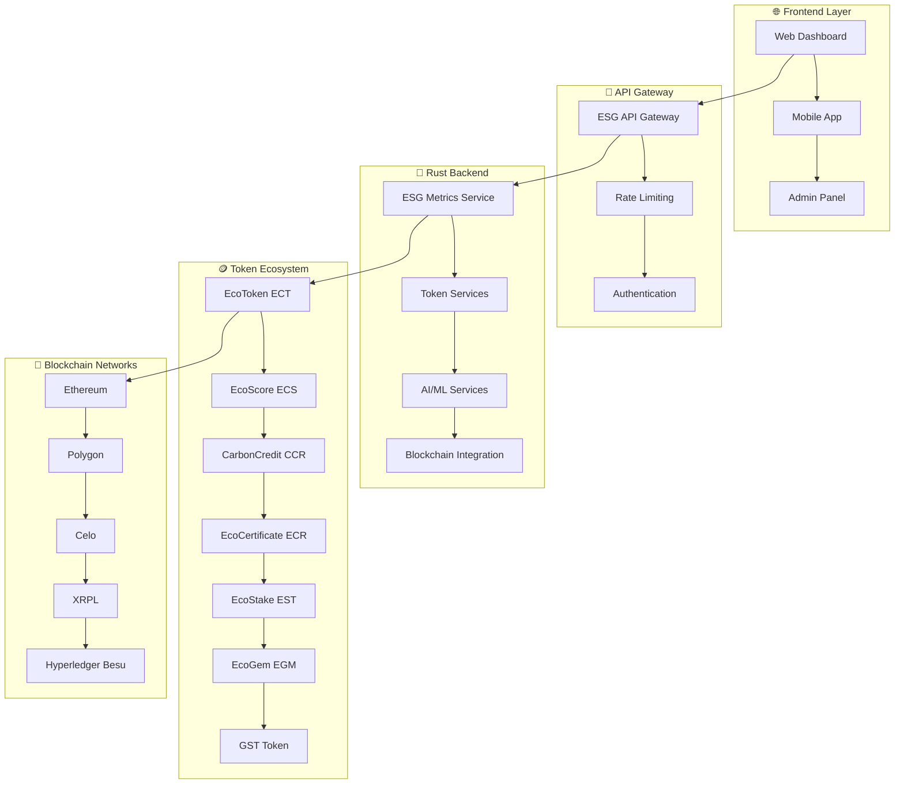

# 🌱 **ECOSYSTEM-DEGOV**
## **ESG Token Ecosystem - Backend Rust para Tokenização ESG**

[](https://www.rust-lang.org/)
[](https://github.com/tokio-rs/axum)
[](https://ethereum.org/)
[](https://en.wikipedia.org/wiki/Environmental,_social,_and_corporate_governance)
[](https://github.com/SH1W4/ecosystem-degov)
[](LICENSE)

---

## 🎯 **VISÃO GERAL**

O **Ecosystem-Degov** é um backend Rust de alta performance para tokenização de métricas ESG (Environmental, Social, and Governance), projetado para criar um ecossistema sustentável tokenizado com 7 tokens interconectados e blockchain híbrida.

### **Características Principais:**
- 🪙 **7 Tokens ESG** - ECT, ECS, CCR, ECR, EST, EGM, GST
- 🔗 **Blockchain Híbrida** - Privada (Hyperledger Besu) + Pública (Ethereum, Polygon, Celo, XRPL)
- 🤖 **AI/ML Integrado** - Computer Vision, NLP, Analytics, Predictions
- 🏗️ **Arquitetura Modular** - Microserviços escaláveis
- 🔒 **Segurança Enterprise** - Criptografia robusta e compliance
- 📊 **Analytics ESG** - Dashboards e insights em tempo real
- 🌐 **Cross-Platform** - Integração com GuardFlow e GuardDrive

---

## 🏗️ **ARQUITETURA**

### **ESG Token Ecosystem Architecture:**



---

## 🚀 **INSTALAÇÃO E CONFIGURAÇÃO**

### **Pré-requisitos:**
- Rust 1.70+
- PostgreSQL 15+
- Redis 7+
- Docker (opcional)

### **Quick Start:**

1. **Clone o repositório**
   ```bash
   git clone https://github.com/SH1W4/ecosystem-degov.git
   cd ecosystem-degov
   ```

2. **Instalar dependências**
   ```bash
   cargo build --release
   ```

3. **Configurar variáveis de ambiente**
   ```bash
   cp .env.example .env
   # Editar .env com suas configurações
   ```

4. **Executar o backend**
   ```bash
   cargo run --release
   ```

5. **Testar a API**
   ```bash
   curl http://localhost:3000/health
   ```

---

## 📊 **API ENDPOINTS**

### **Health Check:**
- `GET /health` - Status do serviço

### **ESG Integration:**
- `GET /api/v1/esg/unified-profile/:user_id` - Perfil ESG unificado
- `POST /api/v1/esg/transfer-unified` - Transferência unificada
- `GET /api/v1/esg/platform-metrics/:user_id` - Métricas de plataforma

### **EcoToken Ecosystem:**
- `GET /api/v1/ecosystem/balance/:user_id` - Balance do ecossistema
- `POST /api/v1/ecosystem/transfer` - Transferência cross-ecosystem
- `GET /api/v1/ecosystem/stats` - Estatísticas do ecossistema

### **7 Tokens ESG:**
- **EcoToken (ECT)**: `GET /api/v1/ecotoken/balance/:address`
- **EcoScore (ECS)**: `GET /api/v1/ecoscore/profile/:user_id`
- **CarbonCredit (CCR)**: `GET /api/v1/carboncredits/balance/:user_id`
- **EcoCertificate (ECR)**: `GET /api/v1/certificates/user/:user_id`
- **EcoStake (EST)**: `GET /api/v1/ecostake/position/:user_id`
- **EcoGem (EGM)**: `GET /api/v1/ecogem/balance/:user_id`
- **GST Token**: `GET /api/v1/gst/balance/:address/:token_id`

---

## 🪙 **ECOSYSTEM DE 7 TOKENS**

### **1. EcoToken (ECT) - Token Principal**
- **Propósito**: Token principal de utilidade
- **Blockchain**: Ethereum, Polygon, Celo
- **Supply**: 1,000,000,000 ECT
- **Use Cases**: Pagamentos, Staking, Governance

### **2. EcoScore (ECS) - Score ESG Tokenizado**
- **Propósito**: Score ESG tokenizado
- **Blockchain**: Hyperledger Besu (Private)
- **Supply**: Dinâmico baseado em métricas
- **Use Cases**: Avaliação, Certificação, Compliance

### **3. CarbonCredit (CCR) - Créditos de Carbono**
- **Propósito**: Créditos de carbono
- **Blockchain**: Ethereum, Polygon
- **Supply**: Baseado em reduções verificadas
- **Use Cases**: Compensação, Trading, Compliance

### **4. EcoCertificate (ECR) - Certificados de Sustentabilidade**
- **Propósito**: Certificados de sustentabilidade
- **Blockchain**: Ethereum (ERC-721)
- **Supply**: Limitado por certificação
- **Use Cases**: Certificação, Verificação, Compliance

### **5. EcoStake (EST) - Sistema de Staking**
- **Propósito**: Staking e recompensas
- **Blockchain**: Ethereum, Polygon
- **Supply**: Dinâmico baseado em staking
- **Use Cases**: Staking, Rewards, Governance

### **6. EcoGem (EGM) - Gemas de Raridade**
- **Propósito**: Gemas de raridade
- **Blockchain**: Ethereum (ERC-1155)
- **Supply**: Limitado e raro
- **Use Cases**: NFTs, Collectibles, Rewards

### **7. GST (Green Sustainability Token) - Token de Sustentabilidade Verde**
- **Propósito**: Token de sustentabilidade verde e gamificação
- **Blockchain**: Ethereum
- **Supply**: 1,000,000,000 GST
- **Use Cases**: Gamificação, Marketplace, Governança, NFE/NFT, Sustentabilidade Verde

---

## 🔗 **INTEGRAÇÃO COM GUARDFLOW**

### **Fluxo de Integração:**
```
GuardFlow (Checkout ESG) → API Gateway → Ecosystem-Degov (ESG Tokens)
                                    ↓
                            Bridge de Integração
                                    ↓
                            Perfil ESG Unificado
```

### **Funcionalidades Integradas:**
- **Cross-Platform Balance** - Saldo unificado entre plataformas
- **ESG Profile Unification** - Perfil ESG consolidado
- **Token Transfer** - Transferência entre implementações
- **Platform Metrics** - Métricas consolidadas
- **Achievements System** - Sistema de conquistas ESG

---

## 🤖 **AI/ML SERVICES**

### **Computer Vision:**
- Análise de imagens ESG
- Reconhecimento de certificações
- Verificação de sustentabilidade

### **NLP (Natural Language Processing):**
- Análise de relatórios ESG
- Extração de métricas
- Classificação de conteúdo

### **Analytics & Predictions:**
- Predição de scores ESG
- Análise de tendências
- Recomendações de melhoria

---

## 🔒 **SEGURANÇA E COMPLIANCE**

### **Padrões de Segurança:**
- **AES-256 Encryption** - Criptografia de dados
- **JWT Authentication** - Autenticação segura
- **Rate Limiting** - Proteção contra ataques
- **Audit Logging** - Logs de auditoria

### **Compliance:**
- **ISO 27001** - Information Security Management
- **SOC 2 Type II** - Security, Availability, Processing Integrity
- **GDPR** - General Data Protection Regulation
- **ESG Standards** - GRI, SASB, TCFD, GHG Protocol

---

## 📈 **MÉTRICAS E KPIs**

### **Métricas Técnicas:**
- **API Response Time**: < 200ms
- **Database Performance**: < 100ms
- **Uptime**: > 99.9%
- **Throughput**: 10k+ TPS

### **Métricas ESG:**
- **Carbon Offset**: 1000+ tons CO2
- **ESG Reports**: 1000+ generated
- **Sustainability Score**: 8.5+ average
- **Green Investments**: $10M+ facilitated

---

## 🧪 **TESTING**

### **Testes Automatizados:**
```bash
# Executar todos os testes
cargo test

# Testes específicos
cargo test --test esg_integration
cargo test --test token_ecosystem
```

### **Testes de Integração:**
```bash
# Testar endpoints ESG
curl -X GET http://localhost:3000/api/v1/esg/unified-profile/user123

# Testar transferência unificada
curl -X POST http://localhost:3000/api/v1/esg/transfer-unified \
  -H "Content-Type: application/json" \
  -d '{"from_platform": "guardrive", "to_platform": "guardflow", "amount": 1000}'
```

---

## 🚀 **DEPLOYMENT**

### **Desenvolvimento:**
```bash
cargo run --bin ecosystem-degov
```

### **Produção:**
```bash
# Docker
docker build -t ecosystem-degov .
docker run -p 3000:3000 ecosystem-degov

# Kubernetes
kubectl apply -f k8s/
```

---

## 📚 **DOCUMENTAÇÃO**

- **API Reference**: `/docs/api-reference.md`
- **Architecture Guide**: `/docs/architecture.md`
- **Development Guide**: `/docs/development.md`
- **ESG Integration**: `/GUARDFLOW_INTEGRATION.md`
- **Consolidation Status**: `/CONSOLIDATION_STATUS.md`

---

## 🤝 **CONTRIBUTING**

Agradecemos contribuições! Por favor, veja nosso [Guia de Contribuição](CONTRIBUTING.md) para detalhes.

1. Fork o repositório
2. Crie sua branch de feature (`git checkout -b feature/AmazingFeature`)
3. Commit suas mudanças (`git commit -m 'Add some AmazingFeature'`)
4. Push para a branch (`git push origin feature/AmazingFeature`)
5. Abra um Pull Request

---

## 📄 **LICENSE**

Este projeto está licenciado sob a Licença MIT - veja o arquivo [LICENSE](LICENSE) para detalhes.

---

## 👥 **TEAM**

- **SH1W4** - *Initial work* - [GitHub](https://github.com/SH1W4)

---

## 🙏 **ACKNOWLEDGMENTS**

- Comunidade Rust e Axum
- Comunidade Blockchain e ESG
- Desenvolvedores de código aberto
- Todos os contribuidores e testadores

---

## 📞 **SUPPORT**

- **Documentação**: [docs.ecosystem-degov.com](https://docs.ecosystem-degov.com)
- **Issues**: [GitHub Issues](https://github.com/SH1W4/ecosystem-degov/issues)
- **Email**: support@ecosystem-degov.com
- **Discord**: [ESG Token Community](https://discord.gg/esg-token)

---

<div align="center">
Made with 🌱 by SH1W4 | ESG Token Ecosystem<br/>
Backend Rust para Tokenização ESG
</div>