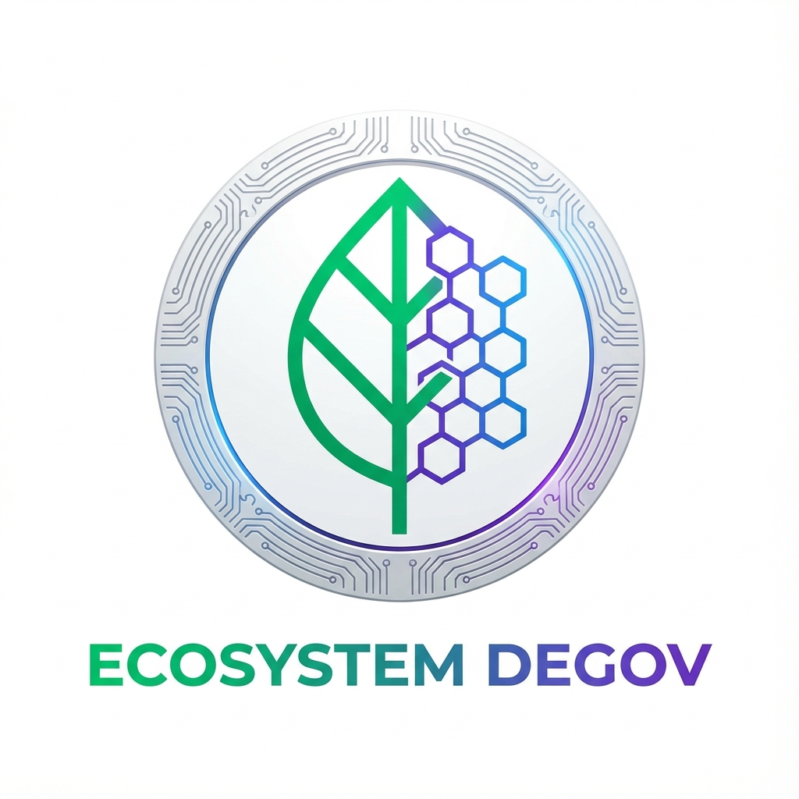
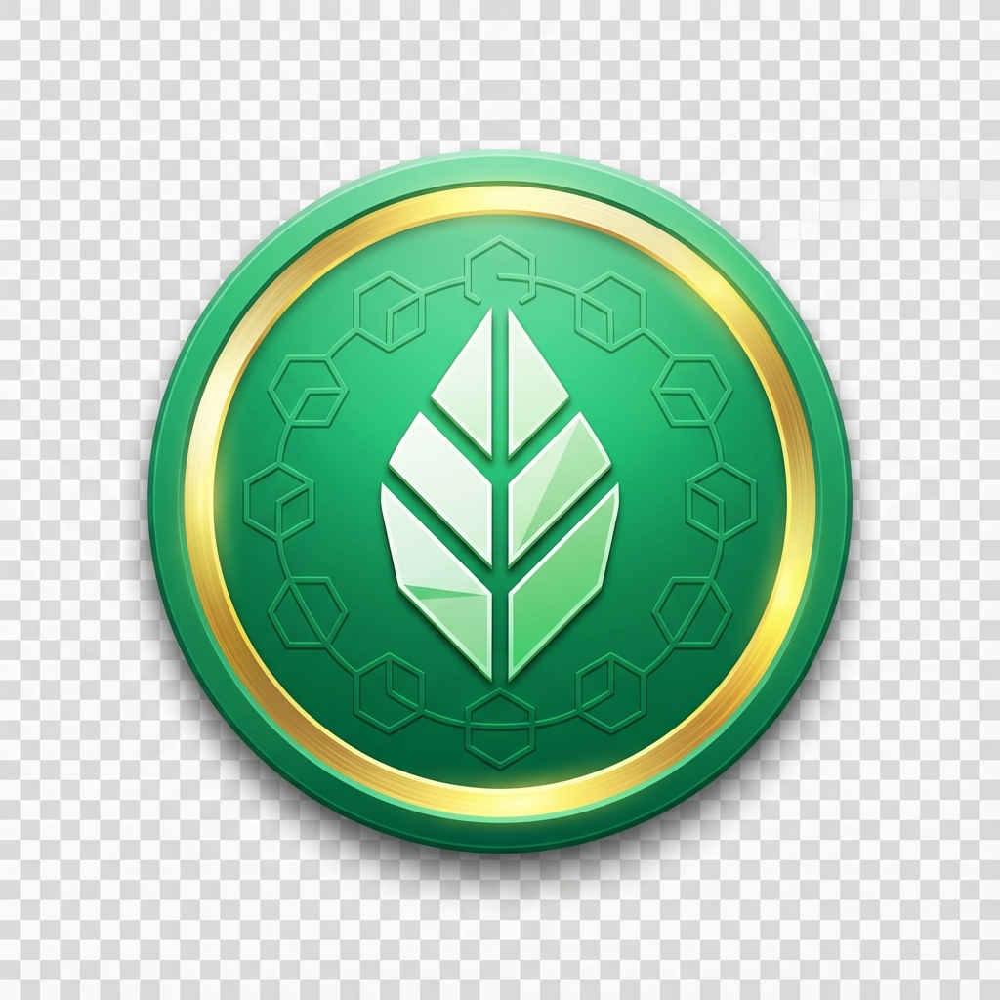
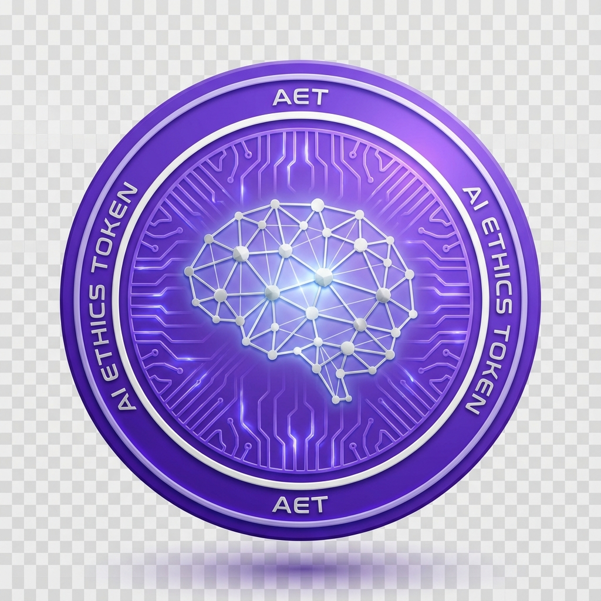
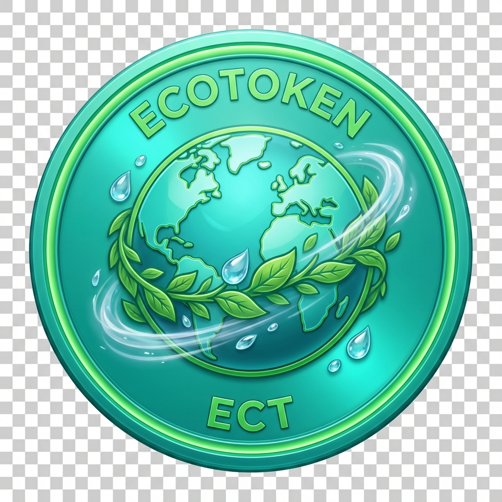
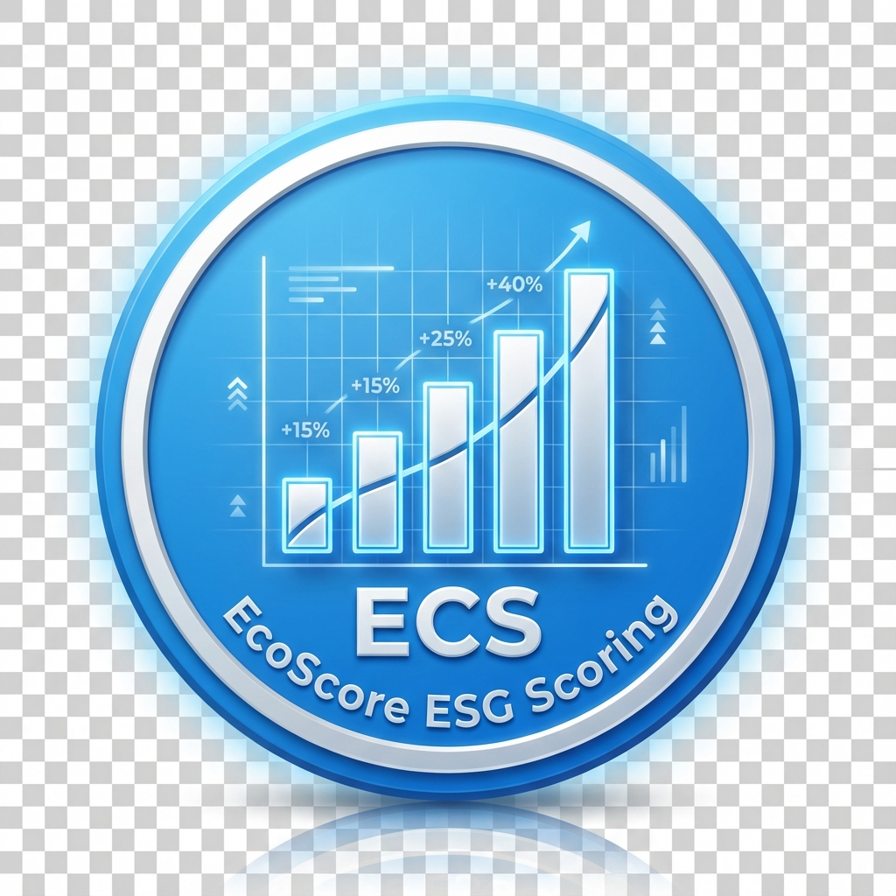
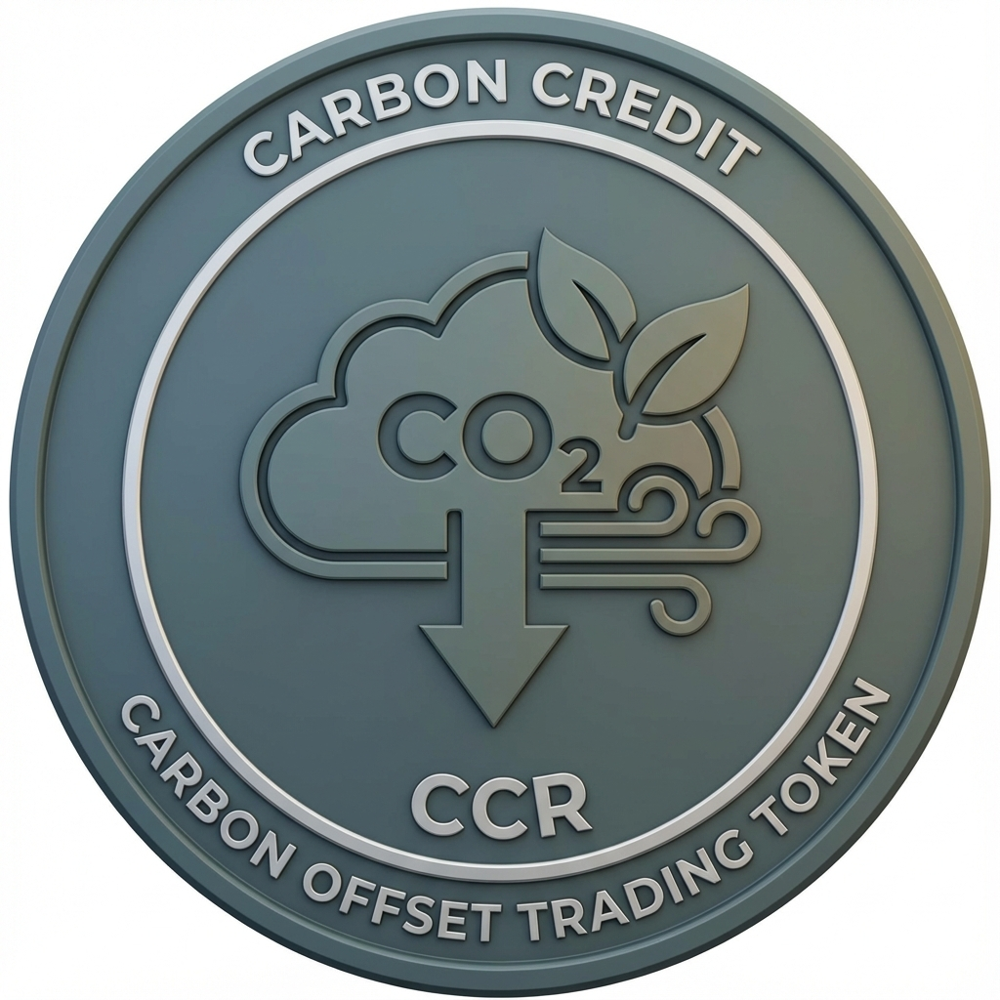
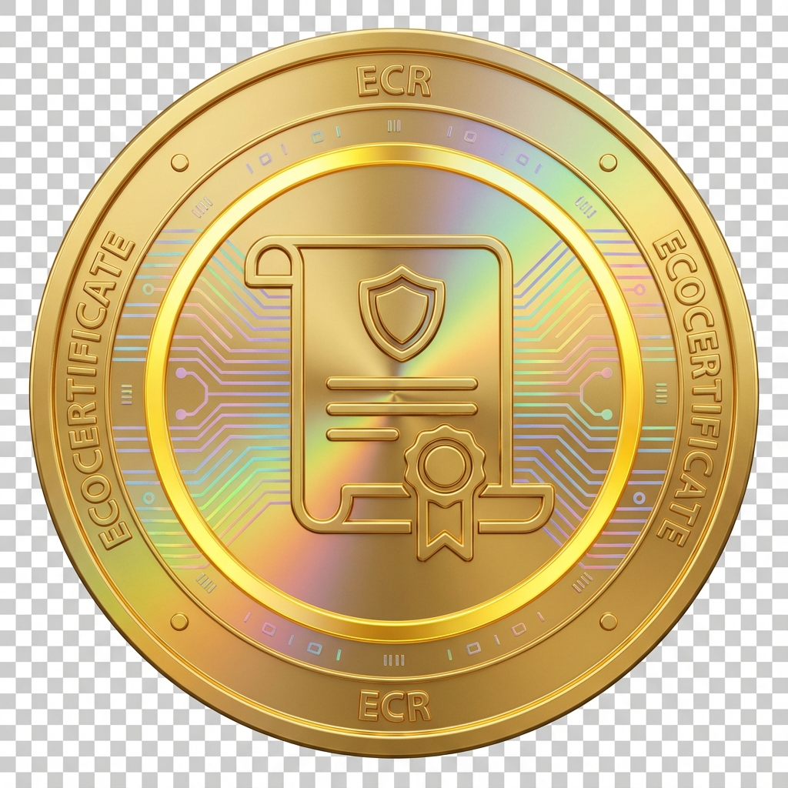
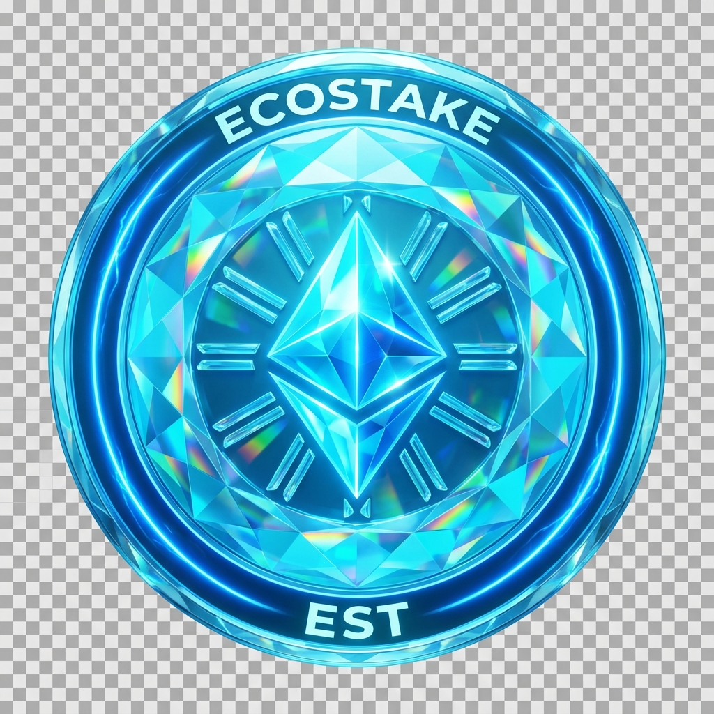
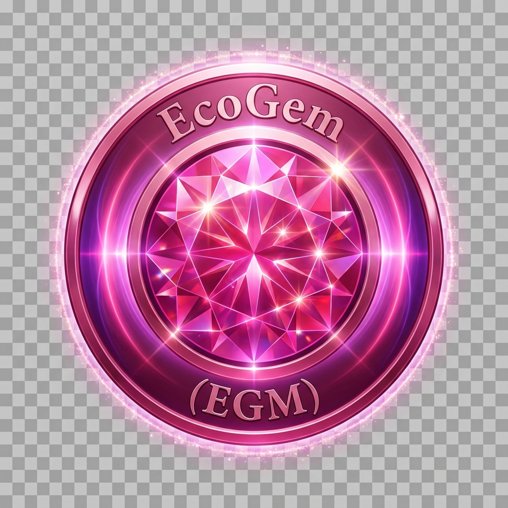

# 🌱 Ecosystem Degov: ESG Token Ecosystem

<div align="center">




**Revolutionary ESG Token Ecosystem with AI Orchestration**

*Tokenizing sustainability, incentivizing impact, building the future*

[📖 Documentation](docs/) | [🏗️ Architecture](docs/ARCHITECTURE_DIAGRAMS.md) | [🎨 Visual Identity](docs/VISUAL_IDENTITY_GUIDE.md)

</div>

---

## 🚀 **What is Ecosystem Degov?**

Ecosystem Degov is a **comprehensive blockchain-based ESG token ecosystem** that tokenizes environmental, social, and governance metrics to create sustainable economic incentives. Our ecosystem combines **8 interconnected tokens** with **AI-powered orchestration** to revolutionize how we measure, reward, and incentivize sustainable practices.

### 🌟 **Core Vision**

Transform sustainability from a cost center into a **profit center** by creating economic incentives for ESG practices through blockchain technology and AI orchestration.

---

## 🏗️ **Ecosystem Architecture**

### 🪙 **8 Interconnected Tokens**

<div align="center">

| Icon | Token | Symbol | Purpose | Color |
|------|-------|--------|---------|-------|
|  | **Green Sustainability Token** | GST | Principal ecosystem token | 🟢 #00C853 |
|  | **AI Ethics Token** | AET | Ethical AI incentives | 🟣 #7C4DFF |
|  | **EcoToken** | ECT | Environmental impact | 🔵 #00BFA5 |
|  | **EcoScore** | ECS | ESG scoring system | 🔷 #2196F3 |
|  | **Carbon Credit** | CCR | Carbon offset trading | ⚫ #607D8B |
|  | **EcoCertificate** | ECR | Achievement certificates | 🟡 #FFB300 |
|  | **EcoStake** | EST | Staking rewards | 🔵 #00E5FF |
|  | **EcoGem** | EGM | Premium rewards | 🔴 #E91E63 |

</div>

### 🤖 **Trinity AI Agent: The Orchestrator**

Our **autonomous AI agent** manages the complexity of the ecosystem:

- **🧠 Intelligent Management**: 24/7 ecosystem monitoring and optimization
- **📊 Real-time Analytics**: Continuous ESG metrics analysis
- **⚡ Auto-optimization**: Dynamic token parameter adjustment
- **🔧 Self-healing**: Automatic problem detection and resolution
- **🌐 MCP Integration**: Connects with LLMs, IDEs, and external services

**Trinity Architecture** - Three Pillars:
1. **Satoshi Pillar**: Trust Score System & Security
2. **Vitalik Pillar**: Composability & Cross-Chain
3. **ESG Pillar**: Impact Scoring & Metrics

> 📊 See detailed [Architecture Diagrams](docs/ARCHITECTURE_DIAGRAMS.md) for system visualization

---

## ✨ **Key Features**

### 🌱 **ESG Tokenization**
```solidity
// Example: GST Token with Trinity Architecture
contract TrinityGSTToken is ERC20, Ownable, Pausable {
    // Satoshi Pillar: Trust Score System
    mapping(address => uint256) public trustScores;
    
    // Vitalik Pillar: Composability
    function crossChainTransfer(address to, uint256 amount) external;
    
    // Our Vision: ESG Impact Scoring
    function updateESGScore(address user, uint256 score) external;
}
```

### 🎯 **Sustainability Incentives**
- **Carbon Footprint Rewards**: Earn GST for reducing emissions
- **Social Impact Bonuses**: AET tokens for ethical AI practices
- **Governance Participation**: Voting rights with token holdings
- **Achievement Certificates**: NFT-based sustainability certifications

### 🔗 **Cross-Platform Integration**
- **Virtual Protocol**: AI agent monetization
- **GuardFlow**: Security and compliance
- **GuardDrive**: Mobility telemetry integration
- **Smart Cart**: Retail sustainability tracking

---

## 🛠️ **Technical Stack**

### 🦀 **Backend (Rust)**
- **High Performance**: Built for enterprise-scale operations
- **Memory Safety**: Zero-cost abstractions with safety guarantees
- **Concurrency**: Async/await for maximum throughput
- **Security**: Enterprise-grade security practices

### ⛓️ **Blockchain (Solidity)**
- **Ethereum**: Primary blockchain network
- **Polygon**: Layer 2 scaling solution
- **Celo**: Mobile-first blockchain integration
- **XRPL**: Cross-border payments

### 🤖 **AI Orchestration**
- **Trinity AI Agent**: Autonomous ecosystem management
- **MCP Server**: Model Context Protocol integration
- **LLM Integration**: OpenAI, Anthropic, Claude
- **IDE Integration**: VSCode, Cursor, IntelliJ

---

## 🚀 **Getting Started**

### Prerequisites
- Rust 1.70+
- Node.js 18+
- Hardhat
- Git

### Quick Start
```bash
# Clone the ecosystem
git clone https://github.com/SH1W4/ecosystem-degov.git
cd ecosystem-degov

# Install dependencies
npm install
cargo build

# Deploy smart contracts
npx hardhat deploy

# Start Trinity AI Agent
cargo run --bin trinity_ai_agent
```

### Environment Setup
```bash
# Copy environment template
cp .env.example .env

# Configure your environment
# Add your private keys, RPC URLs, etc.
```

---

## 📊 **Ecosystem Metrics**

### 🎯 **Token Distribution**
- **GST**: 1,000,000,000 tokens (Principal)
- **AET**: 500,000,000 tokens (AI Ethics)
- **ECT**: 100,000,000 tokens (Environmental)
- **CCR**: 50,000,000 tokens (Carbon Credits)
- **ECS**: 25,000,000 tokens (Scoring)
- **ECR**: 10,000,000 tokens (Certificates)
- **EST**: 5,000,000 tokens (Staking)
- **EGM**: 1,000,000 tokens (Premium)

### 📈 **Performance Metrics**
- **Transaction Speed**: < 2 seconds
- **Gas Efficiency**: Optimized for low costs
- **Scalability**: 10,000+ TPS
- **Security**: Audited smart contracts
- **Uptime**: 99.9% availability

---

## 🌍 **Use Cases**

### 🏢 **Corporate ESG Management**
- **Carbon Tracking**: Monitor and reduce corporate carbon footprint
- **ESG Reporting**: Automated sustainability reporting
- **Stakeholder Engagement**: Token-based governance participation
- **Compliance**: Automated regulatory compliance

### 🏠 **Individual Sustainability**
- **Green Actions**: Earn tokens for sustainable behaviors
- **Carbon Offsets**: Trade carbon credits directly
- **Achievement Tracking**: NFT-based sustainability certificates
- **Community Rewards**: Participate in sustainability challenges

### 🤖 **AI Ethics & Development**
- **Ethical AI**: Reward AI systems for ethical behavior
- **Transparency**: Track AI decision-making processes
- **Bias Detection**: Identify and correct AI biases
- **Human Alignment**: Ensure AI serves human values

---

## 🔮 **Roadmap**

### 🎯 **Phase 1: Foundation (Q1 2025)**
- ✅ **Smart Contracts**: All 8 tokens deployed
- ✅ **Trinity AI Agent**: Autonomous orchestration
- ✅ **Basic Integration**: Core ecosystem functionality
- 🔄 **Testnet Deployment**: Goerli, Sepolia, Mumbai

### 🌐 **Phase 2: Expansion (Q2 2025)**
- 🎯 **Mainnet Deployment**: Ethereum, Polygon
- 🎯 **Virtual Protocol Integration**: AI agent monetization
- 🎯 **Advanced Features**: Gamification, NFTs
- 🎯 **Community Building**: User adoption

### 🚀 **Phase 3: Scale (Q3-Q4 2025)**
- 🌍 **Global Expansion**: 10+ countries
- 🌍 **Enterprise Partnerships**: Corporate adoption
- 🌍 **Advanced AI**: Predictive analytics
- 🌍 **Ecosystem Maturity**: Full feature set

---

## 🤝 **Contributing**

We welcome contributions to build a more sustainable future!

### Development Setup
```bash
# Fork and clone
git clone https://github.com/your-username/ecosystem-degov.git
cd ecosystem-degov

# Install dependencies
npm install
cargo build

# Run tests
npm test
cargo test

# Start development
npm run dev
cargo run
```

### Contribution Areas
- **Smart Contract Development**: Solidity expertise
- **Backend Development**: Rust ecosystem
- **AI/ML Integration**: Trinity AI Agent enhancement
- **Frontend Development**: User interfaces
- **Documentation**: Technical writing
- **Testing**: Quality assurance

See [CONTRIBUTING.md](CONTRIBUTING.md) for detailed guidelines.

---

## 📚 **Documentation**

- [🏗️ Architecture Diagrams](docs/ARCHITECTURE_DIAGRAMS.md) - System architecture and data flow
- [🎨 Visual Identity Guide](docs/VISUAL_IDENTITY_GUIDE.md) - Branding and design assets
- [📖 Full Documentation](docs/) - Complete project documentation

---

## 📄 **License**

This project is licensed under the MIT License - see the [LICENSE](LICENSE) file for details.

---

## 🙏 **Acknowledgments**

Built with ❤️ for a sustainable future by the Ecosystem Degov team.

---

**🌱 Ecosystem Degov** - *Tokenizing Sustainability, Orchestrating Impact*