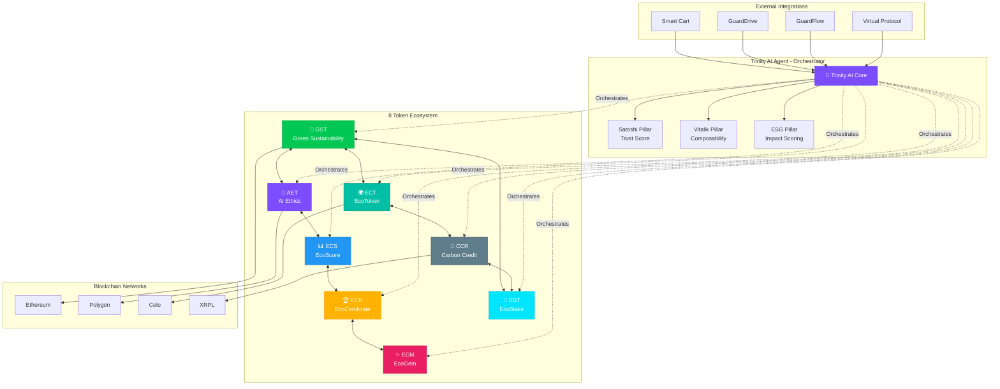
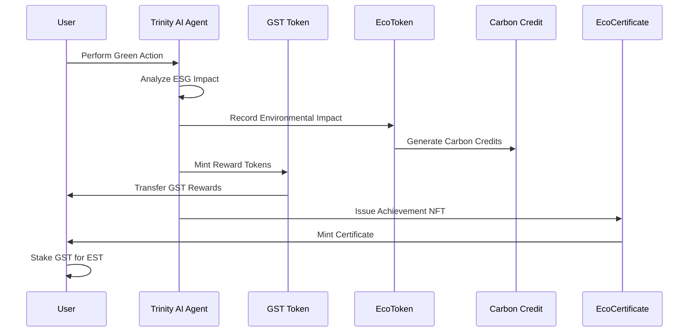
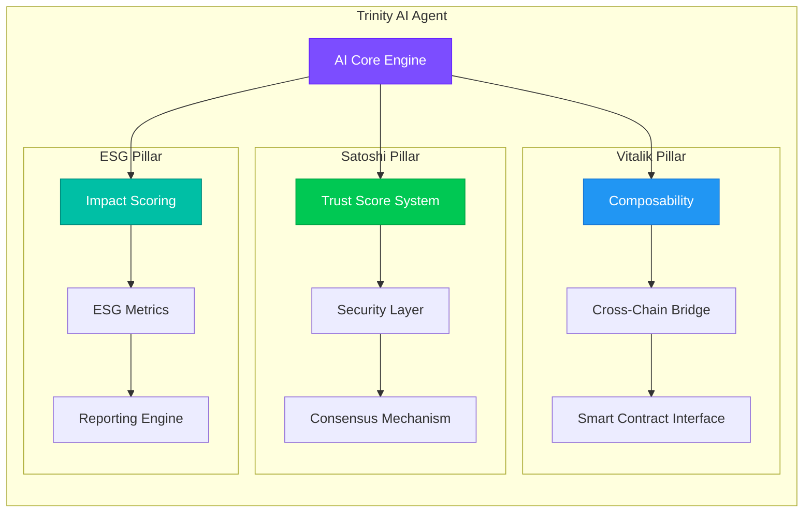
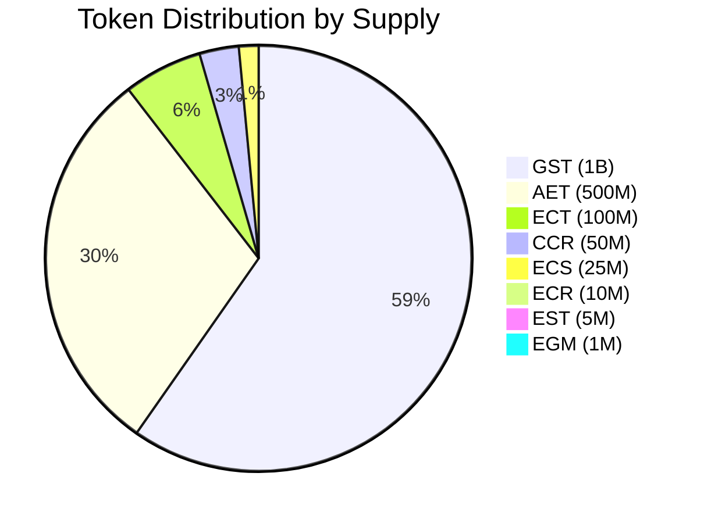
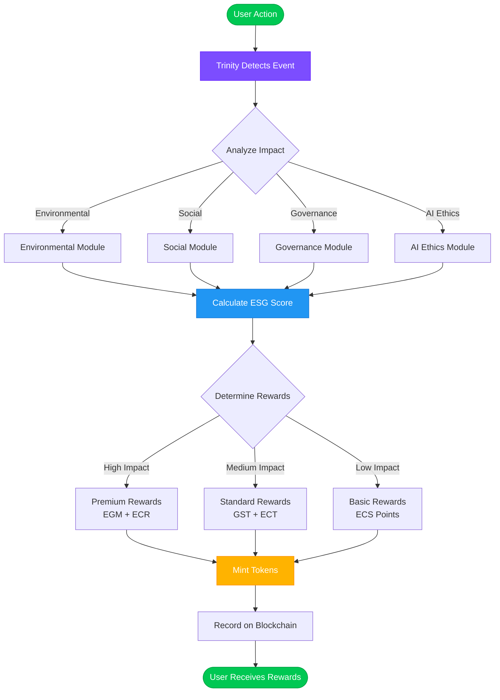
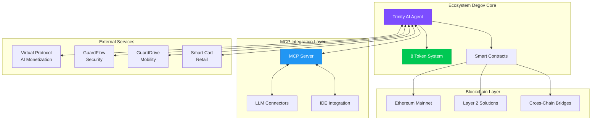

# 🏗️ Ecosystem Degov - Architecture Diagram

## System Architecture Overview

## Token Interaction Flow

## Trinity AI Agent Architecture

## Token Distribution Visualization

## Data Flow Architecture

## Integration Architecture

---

**Architecture Version**: 1.0.0  
**Last Updated**: 2025-11-28  
**Status**: Active Development
