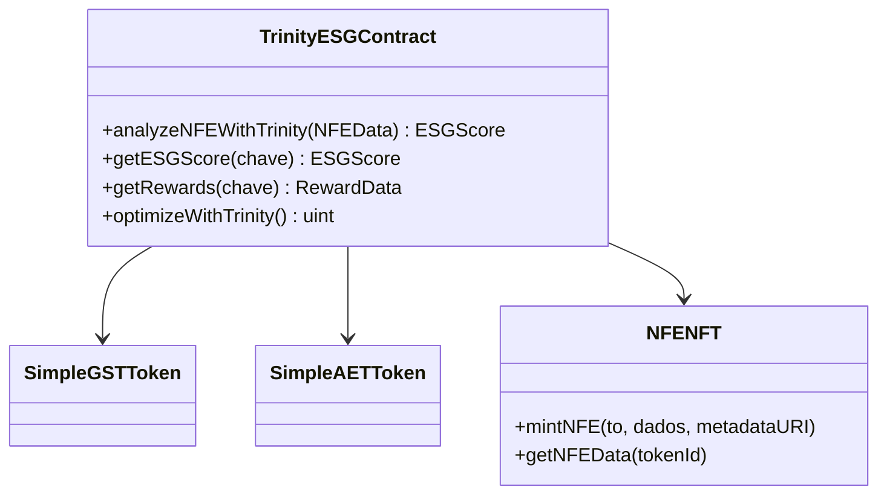
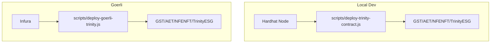
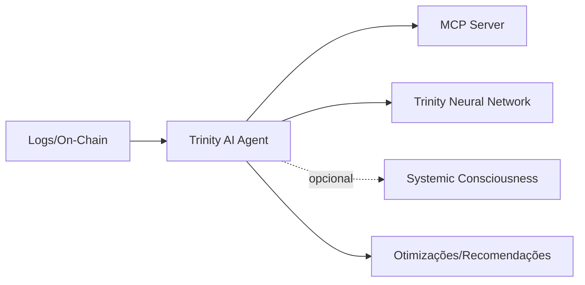
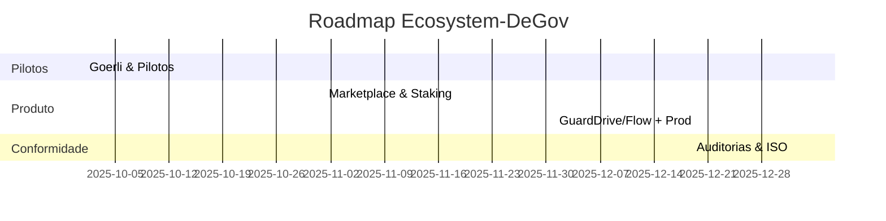
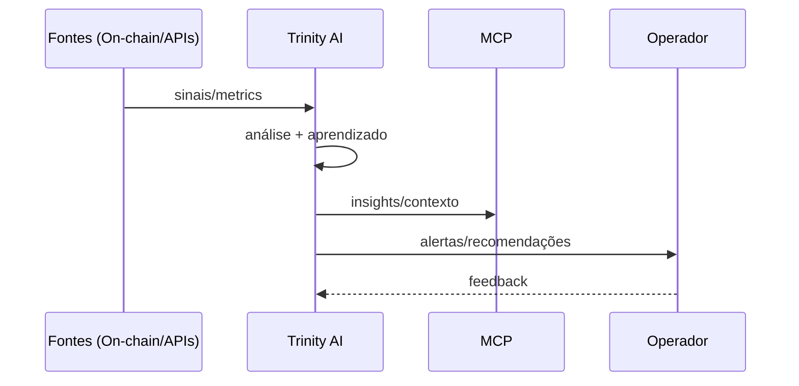
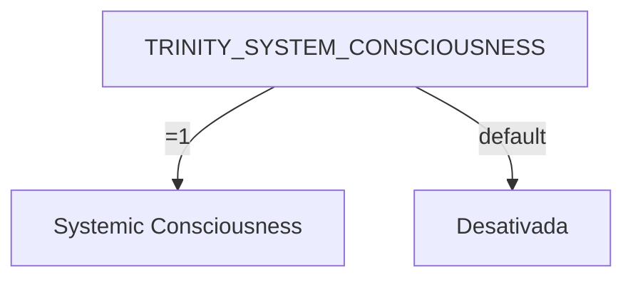
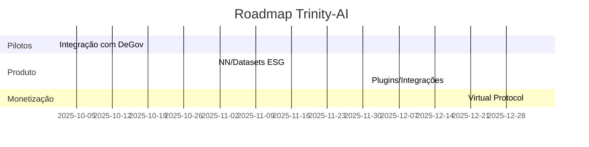

# Investor Pitch – Ecosystem-DeGov Visuals

## 1) Visão Geral do Ecossistema ESG On-Chain
```mermaid
flowchart LR
    A[Empresas/Fornecedores] -->|Emitem NF-e| B[NFENFT (ERC-721)]
    B -->|Metadados ESG| C[ESG Scoring]
    C -->|Score| D[TrinityESGContract]
    D -->|Rewards| E[GST Token]
    D -->|Rewards Éticos| F[AET Token]
    E --> G[Marketplace / Staking]
    F --> G
    G --> H[Governança / KPIs]
## 2) Fluxo NFENFT (NFe como NFT)
```mermaid
sequenceDiagram
    participant Emissor
    participant NFENFT
    participant ESG as ESG Scoring
    participant Trinity as TrinityESGContract
    participant Carteira as Carteira do Usuário

    Emissor->>NFENFT: mintNFE(to, nfeId, metadados ESG)
    NFENFT-->>Emissor: tokenId
    NFENFT->>ESG: enviar metadados
    ESG-->>Trinity: pontuação ESG (E,S,G,total)
    Trinity->>Carteira: transfer/rewards (GST/AET)
```

## 3) Arquitetura de Contratos


## 4) Pipeline de Deploy (Local/Goerli)


## 5) Métricas e KPIs
```mermaid
flowchart LR
    A[Emissões NFENFT] --> B[ESG Coverage]
    B --> C[Rewards Emitidos]
    C --> D[Retenção (Staking/Marketplace)]
    D --> E[Governança]
```

## 6) Integração com Trinity AI (opcional)


## 7) Roadmap Visual (Simplificado)


---

# Investor Pitch – Trinity-AI Visuals

## 1) Visão do Agente
```mermaid
flowchart LR
    Inputs[Eventos + Dados ESG/On-chain] --> Agent[TrinityAIAgent]
    Agent --> MCP[MCP Server]
    Agent --> NN[Trinity Neural Network]
    Agent -. opcional .-> SC[Systemic Consciousness]
    Agent --> Actions[Otimizações | Alertas | Regras]
```

## 2) Ciclo de Operação do Agente


## 3) Ativação Opcional da Consciência Sistêmica


## 4) Métricas do Agente (exemplos)
```mermaid
flowchart LR
    Custo[Redução de custos (gas/infra)] --> ROI[ROI]
    Precisão[Acurácia preditiva ESG] --> ROI
    MTTR[MTTR Incidentes] --> ROI
    Adoção[Adoção por módulos] --> ROI
```

## 5) Roadmap Visual (Simplificado)


