# Fluxo Técnico Trinity ↔ DeGov Tokens

```mermaid
graph TD
    subgraph Trinity Layer
        TA["Trinity AI Agent"]
        NN["Trinity Neural Network"]
        SC["System Consciousness"]
    end

    subgraph Governance Tokens
        GST["GST – Token Principal"]
        AET["AET – Ética de IA"]
        ECT["ECT – Recompensas ESG"]
        CCR["CCR – Créditos de Carbono"]
        ECS["ECS – Sustentabilidade Corporativa"]
        ECR["ECR – Resiliência Climática"]
        EST["EST – Transição Energética"]
        EGM["EGM – Governança Metaverso"]
    end

    TA -->|Monitora métricas, triggers| GST
    TA -->|Atualiza scores éticos| AET
    TA -->|Distribui incentivos| ECT
    TA -->|Valida créditos| CCR
    TA -->|Audita indicadores| ECS
    TA -->|Emite alertas| ECR
    TA -->|Orquestra migração energética| EST
    TA -->|Gerencia governança XR| EGM

    GST -->|Stake feedback| TA
    AET -->|Feedback de ética| TA
    ECT -->|Dados de recompensa| TA
    CCR -->|Inventário carbono| TA
    ECS -->|KPIs ESG| TA
    ECR -->|Métricas climáticas| TA
    EST -->|Dados transição| TA
    EGM -->|Governança coletiva| TA

    TA --> NN
    NN -->|Insights preditivos| TA
    SC -->|Análise sistêmica| TA
```

O diagrama destaca o Trinity como orquestrador central que coleta telemetria dos oito tokens ESG, utiliza a Trinity Neural Network para análises preditivas e, quando ativada, a System Consciousness para avaliações de impacto sistêmico.
