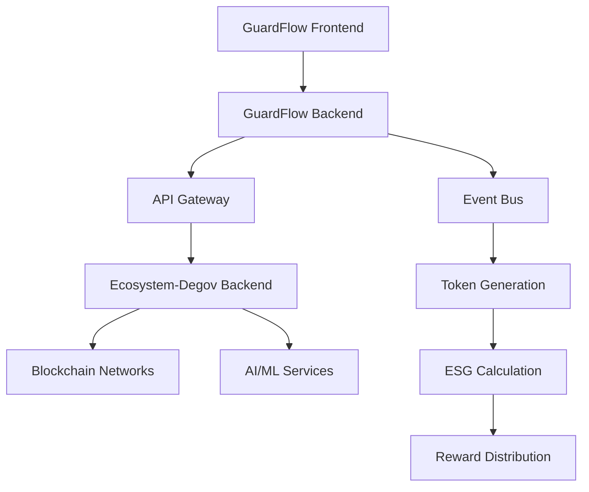

# 🔗 **GUARDFLOW INTEGRATION GUIDE**

## 📋 **VISÃO GERAL DA INTEGRAÇÃO**

Este documento descreve como o **Ecosystem-Degov** se integra com o **GuardFlow** para criar um ecossistema completo de tokenização ESG.

### **🎯 Objetivo da Integração**
- **GuardFlow**: Sistema de checkout ESG para varejo
- **Ecosystem-Degov**: Backend Rust para tokenização ESG
- **Integração**: API Gateway + Event Bus + Shared Services

---

## 🏗️ **ARQUITETURA DE INTEGRAÇÃO**

### **Fluxo de Integração:**


### **Componentes de Integração:**
- **API Gateway**: Roteamento de requisições
- **Event Bus**: Comunicação assíncrona
- **Shared Services**: Serviços compartilhados
- **Data Sync**: Sincronização de dados

---

## 🔌 **ENDPOINTS DE INTEGRAÇÃO**

### **GuardFlow → Ecosystem-Degov:**
```bash
# ESG Token Generation
POST /api/v1/esg/tokenize
{
  "transaction_id": "TXN-123",
  "esg_metrics": {...},
  "user_id": "USER-456"
}

# Token Balance Check
GET /api/v1/tokens/balance/{user_id}

# Cross-Platform Transfer
POST /api/v1/tokens/transfer
{
  "from_user": "USER-123",
  "to_user": "USER-456",
  "amount": 1000,
  "token_type": "ECT"
}
```

### **Ecosystem-Degov → GuardFlow:**
```bash
# ESG Score Update
POST /api/v1/esg/update-score
{
  "user_id": "USER-123",
  "new_score": 85.5,
  "tokens_earned": 150
}

# Token Transaction
POST /api/v1/tokens/transaction
{
  "transaction_id": "TXN-123",
  "token_amount": 1000,
  "blockchain_hash": "0x..."
}
```

---

## 📊 **DADOS COMPARTILHADOS**

### **Estruturas de Dados:**
```rust
// Shared between GuardFlow and Ecosystem-Degov
#[derive(Debug, Clone, Serialize, Deserialize)]
pub struct ESGTransaction {
    pub transaction_id: String,
    pub user_id: String,
    pub esg_score: f64,
    pub tokens_earned: u64,
    pub timestamp: String,
}

#[derive(Debug, Clone, Serialize, Deserialize)]
pub struct TokenBalance {
    pub user_id: String,
    pub ect_balance: u64,
    pub ecs_balance: u64,
    pub ccr_balance: u64,
    pub total_esg_tokens: u64,
}
```

---

## 🔄 **FLUXO DE INTEGRAÇÃO**

### **1. Compra no GuardFlow:**
1. Usuário faz compra
2. GuardFlow calcula ESG score
3. Envia dados para Ecosystem-Degov
4. Ecosystem-Degov gera tokens
5. Retorna confirmação para GuardFlow

### **2. Tokenização ESG:**
1. Ecosystem-Degov recebe métricas ESG
2. Processa com AI/ML
3. Gera tokens correspondentes
4. Atualiza blockchain
5. Notifica GuardFlow

### **3. Cross-Platform Transfer:**
1. Usuário solicita transferência
2. Ecosystem-Degov valida
3. Executa transferência
4. Atualiza saldos
5. Confirma para GuardFlow

---

## 🛠️ **CONFIGURAÇÃO DE INTEGRAÇÃO**

### **Environment Variables:**
```bash
# Ecosystem-Degov
ECOSYSTEM_API_URL=http://localhost:3000
ECOSYSTEM_API_KEY=your-api-key
BLOCKCHAIN_NETWORK=ethereum
AI_SERVICE_URL=http://localhost:3001

# GuardFlow
GUARDFLOW_API_URL=http://localhost:8002
GUARDFLOW_API_KEY=your-api-key
INTEGRATION_MODE=production
```

### **API Gateway Configuration:**
```yaml
api_gateway:
  version: "v1"
  base_url: "https://api.guardflow.com"
  
  services:
    guardflow:
      path: "/api/v1/guardflow"
      upstream: "http://localhost:8002"
      rate_limit: "1000/hour"
    
    ecosystem:
      path: "/api/v1/ecosystem"
      upstream: "http://localhost:3000"
      rate_limit: "500/hour"
```

---

## 🧪 **TESTING DE INTEGRAÇÃO**

### **Testes Automatizados:**
```bash
# Testar integração GuardFlow → Ecosystem-Degov
curl -X POST http://localhost:8002/api/v1/integration/test \
  -H "Content-Type: application/json" \
  -d '{"test_type": "esg_tokenization"}'

# Testar integração Ecosystem-Degov → GuardFlow
curl -X POST http://localhost:3000/api/v1/integration/test \
  -H "Content-Type: application/json" \
  -d '{"test_type": "token_balance"}'
```

### **Testes de Carga:**
```bash
# Teste de carga na integração
artillery run integration-load-test.yml
```

---

## 📈 **MONITORAMENTO**

### **Métricas de Integração:**
- **API Response Time**: < 200ms
- **Integration Success Rate**: > 99%
- **Token Generation Time**: < 5s
- **Cross-Platform Transfer**: < 10s

### **Dashboards:**
- **GuardFlow Dashboard**: Métricas de checkout
- **Ecosystem Dashboard**: Métricas de tokenização
- **Integration Dashboard**: Métricas de integração

---

## 🚀 **DEPLOYMENT**

### **Desenvolvimento:**
```bash
# Iniciar GuardFlow
cd GuardFlow/backend
uvicorn app.main:app --host 127.0.0.1 --port 8002

# Iniciar Ecosystem-Degov
cd ecosystem-degov
cargo run --bin ecosystem-degov
```

### **Produção:**
```bash
# Docker Compose
docker-compose up -d

# Kubernetes
kubectl apply -f k8s/
```

---

## 🔧 **TROUBLESHOOTING**

### **Problemas Comuns:**
1. **API Connection Failed**: Verificar URLs e chaves
2. **Token Generation Failed**: Verificar blockchain connection
3. **Data Sync Issues**: Verificar Event Bus
4. **Performance Issues**: Verificar rate limits

### **Logs:**
```bash
# GuardFlow logs
tail -f GuardFlow/backend/logs/app.log

# Ecosystem-Degov logs
tail -f ecosystem-degov/logs/ecosystem.log
```

---

## 📚 **DOCUMENTAÇÃO ADICIONAL**

- **API Reference**: `/docs/api-reference.md`
- **Architecture Guide**: `/docs/architecture.md`
- **Deployment Guide**: `/docs/deployment.md`

---

**🔗 Integração GuardFlow ↔ Ecosystem-Degov - Ecossistema ESG Completo! 🌱**
