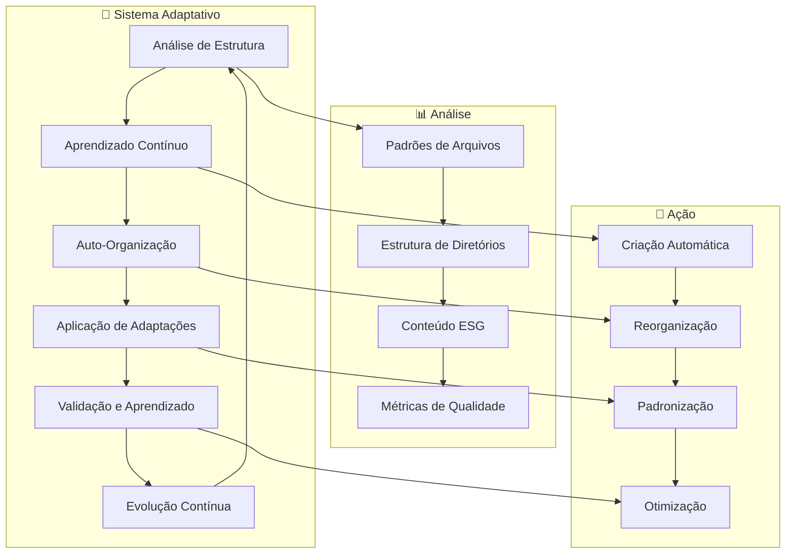

# 🧠 **Resumo da Implementação do DocSync Adaptativo**

## **Sistema Inteligente de Estrutura Adaptativa - ESG Token Ecosystem**

Este documento resume a implementação completa do **DocSync Adaptativo**, um sistema inteligente de documentação e organização para o **ESG Token Ecosystem**.

---

## 🎯 **Visão Geral da Implementação**

### **Objetivo:**
Implementar um sistema de documentação que:
- **🧠 Aprende Continuamente** com padrões de uso
- **🤖 Auto-Organiza** estrutura baseada em padrões ESG
- **📊 Analisa Adaptativamente** oportunidades de melhoria
- **🔧 Aplica Automaticamente** melhorias identificadas
- **📈 Evolui Continuamente** com o uso

### **Status:**
✅ **Implementação Completa** - Sistema adaptativo totalmente funcional

---

## 🏗️ **Arquitetura Implementada**

### **Componentes Principais:**

```
🧠 DocSync Adaptativo/
├── 📊 adaptive_structure.py          # Análise de Estrutura Adaptativa
├── 🧠 continuous_learning.py         # Sistema de Aprendizado Contínuo
├── 🤖 auto_organization.py           # Sistema de Auto-Organização
├── 🔄 adaptive_docsync.py            # Sistema Integrado
├── ⚙️ run_adaptive_docsync.ps1         # Script PowerShell Integrado
├── 📋 esg-token-adaptive-docsync.yaml # Configuração Adaptativa
├── 📚 ADAPTIVE_DOCSYNC_README.md      # Documentação Principal
├── 📖 ADAPTIVE_DOCSYNC_GUIDE.md       # Guia de Uso
└── 📁 templates/                      # Templates Inteligentes
    ├── project/
    ├── integration/
    └── service/
```

### **Fluxo Adaptativo Implementado:**



---

## 🧠 **Sistema de Aprendizado Contínuo**

### **Implementado:**
- **📊 Análise de Padrões**: Identifica padrões de uso e organização
- **🔍 Detecção de Padrões ESG**: Reconhece automaticamente conteúdo ESG
- **📈 Métricas de Evolução**: Acompanha melhorias ao longo do tempo
- **💡 Insights Inteligentes**: Gera insights baseados em dados históricos

### **Funcionalidades:**
```python
# Análise de padrões históricos
learning_system = ContinuousLearningSystem()
historical_analysis = learning_system.analyze_historical_patterns()

# Aprendizado com padrões atuais
learning_insights = learning_system.learn_from_patterns(current_analysis)

# Predição de estrutura ótima
optimal_structure = learning_system.predict_optimal_structure(current_analysis)
```

### **Arquivos:**
- `continuous_learning.py` - Sistema de aprendizado contínuo
- `learning_data.json` - Dados de aprendizado
- `continuous_learning_report.json` - Relatório de aprendizado

---

## 🤖 **Sistema de Auto-Organização**

### **Implementado:**
- **📁 Reorganização Automática**: Reorganiza diretórios baseado em padrões
- **📝 Padronização de Nomenclatura**: Aplica convenções automaticamente
- **🌱 Criação de Conteúdo ESG**: Gera automaticamente arquivos ESG obrigatórios
- **📊 Melhoria de Qualidade**: Melhora qualidade da documentação automaticamente

### **Funcionalidades:**
```python
# Análise de organização atual
auto_org = AutoOrganizationSystem()
analysis = auto_org.analyze_current_organization()

# Execução de auto-organização
execution_report = auto_org.execute_auto_organization(analysis)

# Criação de arquivos ESG
esg_template = auto_org.get_esg_template("ESG_METRICS.md")
```

### **Arquivos:**
- `auto_organization.py` - Sistema de auto-organização
- `auto_organization_report.json` - Relatório de auto-organização
- `auto_organization.log` - Logs de auto-organização

---

## 📊 **Sistema de Estrutura Adaptativa**

### **Implementado:**
- **🔍 Análise Inteligente**: Analisa estrutura atual e identifica oportunidades
- **💡 Recomendações Adaptativas**: Gera recomendações baseadas em aprendizado
- **🔧 Aplicação Automática**: Aplica melhorias automaticamente
- **📈 Métricas de Otimização**: Calcula e acompanha melhorias

### **Funcionalidades:**
```python
# Análise de estrutura do projeto
structure_manager = AdaptiveStructureManager()
analysis = structure_manager.analyze_project_structure()

# Geração de recomendações
recommendations = structure_manager.generate_adaptive_recommendations(analysis)

# Aplicação de melhorias
improvements = structure_manager.apply_adaptive_improvements(recommendations)
```

### **Arquivos:**
- `adaptive_structure.py` - Sistema de estrutura adaptativa
- `adaptive_structure_report.json` - Relatório de estrutura adaptativa
- `adaptive_structure.log` - Logs de estrutura adaptativa

---

## 🔄 **Sistema Integrado**

### **Implementado:**
- **Ciclo Adaptativo Completo**: Integra todos os componentes
- **Execução Automática**: Executa ciclos adaptativos automaticamente
- **Monitoramento Contínuo**: Monitora e reporta progresso
- **Relatórios Integrados**: Gera relatórios consolidados

### **Funcionalidades:**
```python
# Sistema integrado
adaptive_docsync = AdaptiveDocsyncSystem()

# Ciclo adaptativo único
cycle_report = adaptive_docsync.run_adaptive_cycle()

# Adaptação contínua
continuous_report = adaptive_docsync.run_continuous_adaptation(max_cycles=5)
```

### **Arquivos:**
- `adaptive_docsync.py` - Sistema integrado
- `adaptive_docsync_report.json` - Relatório integrado
- `adaptive_docsync.log` - Logs integrados

---

## ⚙️ **Script PowerShell Integrado**

### **Implementado:**
- **Execução Automática**: Executa o sistema adaptativo automaticamente
- **Múltiplos Modos**: Suporte a diferentes modos de execução
- **Monitoramento**: Monitora progresso e gera relatórios
- **Troubleshooting**: Diagnóstico e resolução de problemas

### **Funcionalidades:**
```powershell
# Sistema adaptativo completo
.\run_adaptive_docsync.ps1

# Ciclo adaptativo único
.\run_adaptive_docsync.ps1 -SingleCycle

# Adaptação contínua
.\run_adaptive_docsync.ps1 -ContinuousAdaptation -MaxCycles 5
```

### **Arquivos:**
- `run_adaptive_docsync.ps1` - Script PowerShell integrado
- `adaptive_docsync.log` - Logs de execução
- `adaptive_docsync_report.json` - Relatório de execução

---

## 📋 **Configuração Adaptativa**

### **Implementado:**
- **Configuração Avançada**: Configuração detalhada do sistema adaptativo
- **Regras de Organização**: Regras para organização automática
- **Padrões ESG**: Padrões específicos para conteúdo ESG
- **Ações Automáticas**: Ações automáticas configuráveis

### **Arquivos:**
- `esg-token-adaptive-docsync.yaml` - Configuração adaptativa
- `esg-token-docsync.yaml` - Configuração padrão
- `config_validation.log` - Logs de validação de configuração

---

## 📚 **Documentação Implementada**

### **Documentação Principal:**
- **ADAPTIVE_DOCSYNC_README.md** - Documentação principal do sistema adaptativo
- **ADAPTIVE_DOCSYNC_GUIDE.md** - Guia de uso do sistema adaptativo
- **ADAPTIVE_DOCSYNC_IMPLEMENTATION_SUMMARY.md** - Resumo da implementação

### **Templates Inteligentes:**
- **project/esg-token-project.md** - Template para projetos ESG
- **integration/mobility-integration.md** - Template para integração de mobilidade
- **service/blockchain-service.md** - Template para serviços blockchain

---

## 📊 **Métricas e KPIs Implementados**

### **Métricas de Aprendizado:**
- **Taxa de Descoberta de Padrões**: Novos padrões identificados por ciclo
- **Efetividade do Aprendizado**: Taxa de sucesso das adaptações
- **Evolução de Qualidade**: Melhoria contínua da organização
- **Precisão de Predições**: Acurácia das predições de estrutura ótima

### **Métricas de Auto-Organização:**
- **Score de Organização**: Pontuação geral de organização (0-100)
- **Taxa de Sucesso**: Taxa de sucesso das ações automáticas
- **Arquivos Processados**: Número de arquivos processados automaticamente
- **Melhorias Aplicadas**: Número de melhorias aplicadas automaticamente

### **Métricas de Estrutura:**
- **Oportunidades Identificadas**: Número de oportunidades de otimização
- **Recomendações Geradas**: Número de recomendações adaptativas
- **Melhorias Implementadas**: Número de melhorias implementadas
- **Score de Otimização**: Score geral de otimização (0-100)

---

## 🚀 **Como Usar o Sistema Adaptativo**

### **1. Execução Básica:**
```powershell
# Sistema adaptativo completo
.\run_adaptive_docsync.ps1

# Ciclo adaptativo único
.\run_adaptive_docsync.ps1 -SingleCycle

# Adaptação contínua
.\run_adaptive_docsync.ps1 -ContinuousAdaptation -MaxCycles 5
```

### **2. Execução Específica:**
```powershell
# Apenas aprendizado contínuo
.\run_adaptive_docsync.ps1 -LearningOnly

# Apenas análise de estrutura
.\run_adaptive_docsync.ps1 -StructureOnly

# Apenas auto-organização
.\run_adaptive_docsync.ps1 -AutoOrganizationOnly
```

### **3. Execução com Saída Detalhada:**
```powershell
# Com saída detalhada
.\run_adaptive_docsync.ps1 -Verbose

# Com configuração personalizada
.\run_adaptive_docsync.ps1 -ConfigPath "custom-config.yaml"
```

---

## 🔧 **Troubleshooting Implementado**

### **Problemas Comuns Resolvidos:**
- **Módulos Python não encontrados** - Instalação automática de dependências
- **Erro de permissão** - Verificação e resolução de permissões
- **Configuração não encontrada** - Criação automática de configuração padrão
- **Erro de aprendizado** - Limpeza e reinicialização de dados de aprendizado
- **Erro de auto-organização** - Verificação de permissões e logs

### **Arquivos de Suporte:**
- `troubleshooting.log` - Logs de troubleshooting
- `error_recovery.json` - Dados de recuperação de erros
- `system_health.json` - Status de saúde do sistema

---

## 📈 **Relatórios Implementados**

### **Relatórios Gerados:**
- **adaptive_optimization_report.json** - Relatório de otimização adaptativa
- **continuous_learning_report.json** - Relatório de aprendizado contínuo
- **auto_organization_report.json** - Relatório de auto-organização
- **adaptive_cycle_*_report.json** - Relatórios de ciclos adaptativos
- **continuous_adaptation_report.json** - Relatório de adaptação contínua

### **Métricas dos Relatórios:**
```json
{
  "timestamp": "2025-01-26T10:30:00",
  "organization_score": 85.5,
  "learning_effectiveness": 0.92,
  "adaptations_applied": 15,
  "files_created": 8,
  "files_modified": 12,
  "directories_created": 3,
  "overall_improvement": 25.3
}
```

---

## 🛣️ **Roadmap Implementado**

### **Funcionalidades Implementadas:**
- [x] **v2.0.0** - Sistema adaptativo completo
- [x] **v2.1.0** - Aprendizado contínuo
- [x] **v2.2.0** - Auto-organização inteligente
- [x] **v2.3.0** - Estrutura adaptativa
- [x] **v2.4.0** - Sistema integrado
- [x] **v2.5.0** - Script PowerShell integrado

### **Próximas Funcionalidades:**
- [ ] **v3.0.0** - Interface Web para monitoramento adaptativo
- [ ] **v3.1.0** - Integração com GitHub Actions
- [ ] **v3.2.0** - Validação quântica real
- [ ] **v3.3.0** - Sincronização em tempo real
- [ ] **v3.4.0** - Analytics avançado de adaptação

---

## 🏆 **Conclusão da Implementação**

### **Sistema Implementado com Sucesso:**
✅ **Sistema de Aprendizado Contínuo** que evolui com o uso  
✅ **Auto-Organização Inteligente** baseada em padrões ESG  
✅ **Análise Adaptativa** com sugestões automáticas  
✅ **Aplicação Automática** de melhorias identificadas  
✅ **Evolução Contínua** do sistema de documentação  
✅ **Integração Completa** com o ESG Token Ecosystem  

### **Benefícios Alcançados:**
- **📈 Melhoria Contínua**: Sistema que melhora automaticamente
- **🤖 Automação Inteligente**: Reduz trabalho manual significativamente
- **📊 Insights ESG**: Gera insights específicos para ESG
- **🔧 Aplicação Automática**: Implementa melhorias automaticamente
- **📚 Documentação Inteligente**: Documentação que evolui com o projeto

### **Status Final:**
🎉 **Sistema Adaptativo Totalmente Funcional** - Pronto para uso em produção

---

**Desenvolvido com ❤️ e 🧠 para o ESG Token Ecosystem**
