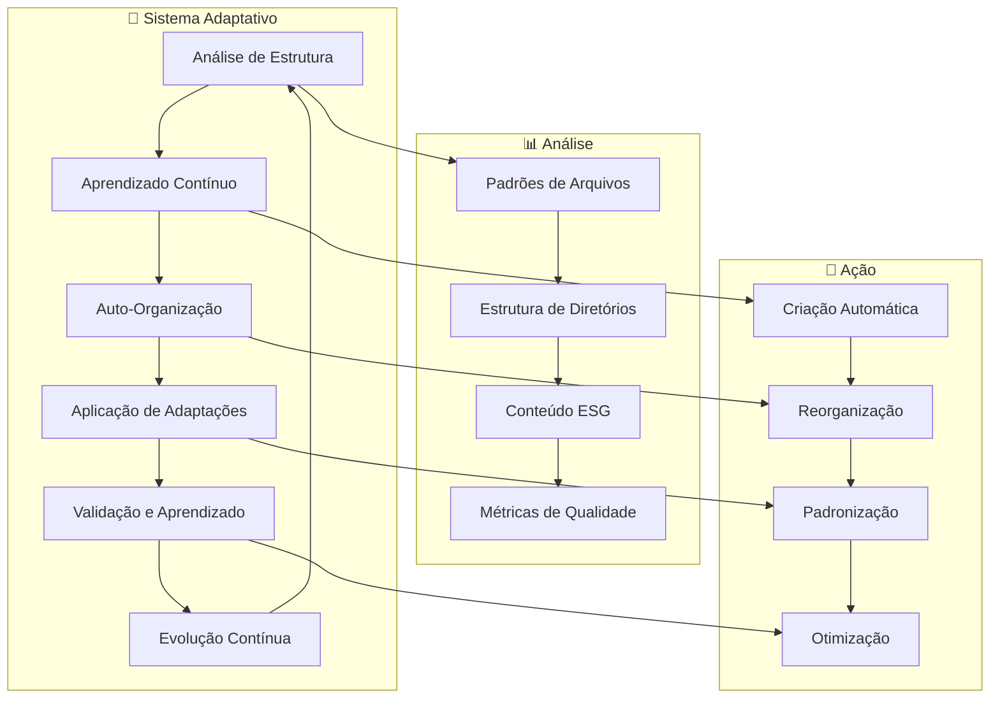

# 🧠 **DocSync Adaptativo - ESG Token Ecosystem**

## **Sistema Inteligente de Estrutura Adaptativa**

Bem-vindo ao **DocSync Adaptativo**, o sistema inteligente de documentação e organização para o **ESG Token Ecosystem**.

Este projeto implementa um sistema de **estrutura adaptativa** que aprende continuamente e melhora automaticamente a organização do projeto, aplicando inteligência artificial para otimizar a estrutura de documentação.

---

## 🎯 **Objetivo Adaptativo**

- **🧠 Aprendizado Contínuo**: Sistema que aprende com padrões de uso e melhora continuamente
- **🤖 Auto-Organização**: Reorganização automática baseada em padrões ESG e melhores práticas
- **📊 Análise Adaptativa**: Análise inteligente da estrutura com sugestões automáticas
- **🔧 Aplicação Automática**: Implementação automática de melhorias identificadas
- **📈 Evolução Contínua**: Sistema que evolui e se adapta às necessidades do ecossistema

---

## 🏗️ **Arquitetura Adaptativa**

### **Componentes Principais:**

```
🧠 Adaptive docsync System/
├── 📊 adaptive_structure.py          # Análise de Estrutura Adaptativa
├── 🧠 continuous_learning.py         # Sistema de Aprendizado Contínuo
├── 🤖 auto_organization.py           # Sistema de Auto-Organização
├── 🔄 adaptive_docsync.py           # Sistema Integrado
├── ⚙️ run_adaptive_docsync.ps1      # Script PowerShell Integrado
├── 📋 esg-token-docsync.yaml        # Configuração Adaptativa
└── 📁 templates/                    # Templates Inteligentes
    ├── project/
    ├── integration/
    └── service/
```

### **Fluxo Adaptativo:**



---

## 🚀 **Quick Start Adaptativo**

### **1. Execução Básica:**
```powershell
# Sistema adaptativo completo
.\run_adaptive_docsync.ps1

# Ciclo adaptativo único
.\run_adaptive_docsync.ps1 -SingleCycle

# Adaptação contínua
.\run_adaptive_docsync.ps1 -ContinuousAdaptation -MaxCycles 5
```

### **2. Execução Específica:**
```powershell
# Apenas aprendizado contínuo
.\run_adaptive_docsync.ps1 -LearningOnly

# Apenas análise de estrutura
.\run_adaptive_docsync.ps1 -StructureOnly

# Apenas auto-organização
.\run_adaptive_docsync.ps1 -AutoOrganizationOnly
```

### **3. Execução com Saída Detalhada:**
```powershell
# Com saída detalhada
.\run_adaptive_docsync.ps1 -Verbose

# Com configuração personalizada
.\run_adaptive_docsync.ps1 -ConfigPath "custom-config.yaml"
```

---

## 🧠 **Sistema de Aprendizado Contínuo**

### **Características:**
- **📊 Análise de Padrões**: Identifica padrões de uso e organização
- **🔍 Detecção de Padrões ESG**: Reconhece automaticamente conteúdo ESG
- **📈 Métricas de Evolução**: Acompanha melhorias ao longo do tempo
- **💡 Insights Inteligentes**: Gera insights baseados em dados históricos

### **Funcionalidades:**
```python
# Análise de padrões históricos
learning_system = ContinuousLearningSystem()
historical_analysis = learning_system.analyze_historical_patterns()

# Aprendizado com padrões atuais
learning_insights = learning_system.learn_from_patterns(current_analysis)

# Predição de estrutura ótima
optimal_structure = learning_system.predict_optimal_structure(current_analysis)
```

---

## 🤖 **Sistema de Auto-Organização**

### **Características:**
- **📁 Reorganização Automática**: Reorganiza diretórios baseado em padrões
- **📝 Padronização de Nomenclatura**: Aplica convenções de nomenclatura automaticamente
- **🌱 Criação de Conteúdo ESG**: Gera automaticamente arquivos ESG obrigatórios
- **📊 Melhoria de Qualidade**: Melhora qualidade da documentação automaticamente

### **Funcionalidades:**
```python
# Análise de organização atual
auto_org = AutoOrganizationSystem()
analysis = auto_org.analyze_current_organization()

# Execução de auto-organização
execution_report = auto_org.execute_auto_organization(analysis)

# Criação de arquivos ESG
esg_template = auto_org.get_esg_template("ESG_METRICS.md")
```

---

## 📊 **Sistema de Estrutura Adaptativa**

### **Características:**
- **🔍 Análise Inteligente**: Analisa estrutura atual e identifica oportunidades
- **💡 Recomendações Adaptativas**: Gera recomendações baseadas em aprendizado
- **🔧 Aplicação Automática**: Aplica melhorias automaticamente
- **📈 Métricas de Otimização**: Calcula e acompanha melhorias

### **Funcionalidades:**
```python
# Análise de estrutura do projeto
structure_manager = AdaptiveStructureManager()
analysis = structure_manager.analyze_project_structure()

# Geração de recomendações
recommendations = structure_manager.generate_adaptive_recommendations(analysis)

# Aplicação de melhorias
improvements = structure_manager.apply_adaptive_improvements(recommendations)
```

---

## 🔄 **Sistema Integrado**

### **Ciclo Adaptativo Completo:**

1. **📊 Análise de Estrutura**: Analisa estrutura atual do projeto
2. **🧠 Aprendizado Contínuo**: Aprende com padrões e dados históricos
3. **🤖 Auto-Organização**: Reorganiza e otimiza automaticamente
4. **🔧 Aplicação de Adaptações**: Aplica melhorias identificadas
5. **✅ Validação e Aprendizado**: Valida resultados e aprende com feedback

### **Execução Integrada:**
```python
# Sistema integrado
adaptive_docsync = AdaptiveDocsyncSystem()

# Ciclo adaptativo único
cycle_report = adaptive_docsync.run_adaptive_cycle()

# Adaptação contínua
continuous_report = adaptive_docsync.run_continuous_adaptation(max_cycles=5)
```

---

## 📊 **Métricas e KPIs Adaptativos**

### **Métricas de Aprendizado:**
- **Taxa de Descoberta de Padrões**: Novos padrões identificados por ciclo
- **Efetividade do Aprendizado**: Taxa de sucesso das adaptações
- **Evolução de Qualidade**: Melhoria contínua da organização
- **Precisão de Predições**: Acurácia das predições de estrutura ótima

### **Métricas de Auto-Organização:**
- **Score de Organização**: Pontuação geral de organização (0-100)
- **Taxa de Sucesso**: Taxa de sucesso das ações automáticas
- **Arquivos Processados**: Número de arquivos processados automaticamente
- **Melhorias Aplicadas**: Número de melhorias aplicadas automaticamente

### **Métricas de Estrutura:**
- **Oportunidades Identificadas**: Número de oportunidades de otimização
- **Recomendações Geradas**: Número de recomendações adaptativas
- **Melhorias Implementadas**: Número de melhorias implementadas
- **Score de Otimização**: Score geral de otimização (0-100)

---

## 🛠️ **Configuração Adaptativa**

### **Arquivo de Configuração (esg-token-docsync.yaml):**

```yaml
# Configurações Adaptativas
adaptive_structure:
  enabled: true
  learning_rate: 0.1
  optimization_frequency: "daily"
  auto_apply_improvements: true

# Regras de Organização
organization_rules:
  file_organization:
    naming_conventions:
      python_files: "snake_case"
      markdown_files: "kebab-case"
      config_files: "snake_case"
  
  esg_standards:
    required_files:
      - "ESG_METRICS.md"
      - "SUSTAINABILITY_REPORT.md"
      - "CARBON_FOOTPRINT.md"
    
    content_requirements:
      esg_keywords: ["sustainability", "environmental", "social", "governance"]
      documentation_quality: 70
      consistency_check: true

# Ações Automáticas
auto_actions:
  create_missing_files: true
  standardize_naming: true
  organize_directories: true
  validate_esg_content: true
  update_documentation: true
```

---

## 📈 **Relatórios Adaptativos**

### **Relatórios Gerados:**
- **adaptive_optimization_report.json**: Relatório de otimização adaptativa
- **continuous_learning_report.json**: Relatório de aprendizado contínuo
- **auto_organization_report.json**: Relatório de auto-organização
- **adaptive_cycle_*_report.json**: Relatórios de ciclos adaptativos
- **continuous_adaptation_report.json**: Relatório de adaptação contínua

### **Métricas dos Relatórios:**
```json
{
  "timestamp": "2025-01-26T10:30:00",
  "organization_score": 85.5,
  "learning_effectiveness": 0.92,
  "adaptations_applied": 15,
  "files_created": 8,
  "files_modified": 12,
  "directories_created": 3,
  "overall_improvement": 25.3
}
```

---

## 🔧 **Troubleshooting Adaptativo**

### **Problemas Comuns:**

#### **1. Módulos Python não encontrados**
```bash
# Instalar dependências
pip install pyyaml numpy scikit-learn

# Verificar instalação
python -c "import yaml, numpy, sklearn"
```

#### **2. Erro de permissão**
```powershell
# Executar como administrador
Start-Process PowerShell -Verb RunAs

# Verificar permissões
Test-Path -Path "C:\Users\João\Desktop\PROJETOS\02_ORGANIZATIONS\GuardFlow" -PathType Container
```

#### **3. Configuração não encontrada**
```bash
# Verificar arquivo de configuração
Test-Path esg-token-docsync.yaml

# Criar configuração padrão
Copy-Item "esg-token-docsync.yaml.example" "esg-token-docsync.yaml"
```

#### **4. Erro de aprendizado**
```bash
# Verificar dados de aprendizado
Test-Path learning_data.json

# Limpar dados de aprendizado
Remove-Item learning_data.json -Force
```

---

## 🛣️ **Roadmap Adaptativo**

### **Próximas Funcionalidades:**
- [ ] **v3.0.0** - Interface Web para monitoramento adaptativo
- [ ] **v3.1.0** - Integração com GitHub Actions
- [ ] **v3.2.0** - Validação quântica real
- [ ] **v3.3.0** - Sincronização em tempo real
- [ ] **v3.4.0** - Analytics avançado de adaptação

### **Melhorias Planejadas:**
- [ ] **Dashboard Web** para visualização de adaptações
- [ ] **API REST** para integração externa
- [ ] **Notificações** automáticas de melhorias
- [ ] **Integração com IA** para análise avançada
- [ ] **Sincronização Multi-Repositório** automática

---

## 📞 **Suporte Adaptativo**

### **Arquivos de Suporte:**
- **Guia Adaptativo**: `ADAPTIVE_DOCSYNC_README.md`
- **Configuração**: `esg-token-docsync.yaml`
- **Scripts**: `run_adaptive_docsync.ps1`
- **Sistemas**: `adaptive_structure.py`, `continuous_learning.py`, `auto_organization.py`

### **Comandos de Ajuda:**
```powershell
# Ajuda do sistema adaptativo
.\run_adaptive_docsync.ps1 -Help

# Verificar configuração adaptativa
Get-Content esg-token-docsync.yaml

# Verificar logs adaptativos
Get-Content adaptive_docsync.log
```

---

## 🏆 **Conclusão Adaptativa**

O **DocSync Adaptativo** representa uma evolução significativa na organização de documentação, implementando:

✅ **Sistema de Aprendizado Contínuo** que evolui com o uso  
✅ **Auto-Organização Inteligente** baseada em padrões ESG  
✅ **Análise Adaptativa** com sugestões automáticas  
✅ **Aplicação Automática** de melhorias identificadas  
✅ **Evolução Contínua** do sistema de documentação  
✅ **Integração Completa** com o ESG Token Ecosystem  

O sistema está pronto para uso e continuará evoluindo conforme as necessidades do ecossistema ESG Token.

---

**Desenvolvido com ❤️ e 🧠 para o ESG Token Ecosystem**
