# 🏢 **Template de Arquitetura Enterprise - ESG Token Ecosystem**

## **Estrutura Corporativa para Tokenização ESG**

Este template serve como base para criar a arquitetura enterprise do ESG Token Ecosystem, garantindo conformidade, escalabilidade e integração corporativa.

---

## 📋 **Informações do Projeto**

- **Título**: [Nome do Projeto ESG]
- **Organização**: [Nome da Organização]
- **Responsável**: [Nome do Responsável]
- **Data de Criação**: [DD/MM/AAAA]
- **Última Atualização**: [DD/MM/AAAA]
- **Versão**: [1.0.0]
- **Status**: [Rascunho / Em Revisão / Aprovado / Produção]

---

## 🎯 **Visão Geral Enterprise**

### **Objetivo Corporativo**
[Descrever o objetivo corporativo do projeto ESG, alinhado com a estratégia da organização]

### **Escopo Enterprise**
- **Funcionalidades Core**: [Listar funcionalidades principais]
- **Integrações Corporativas**: [Sistemas ERP, CRM, BI]
- **Conformidade Regulatória**: [Padrões ESG, regulamentações]
- **Escalabilidade**: [Crescimento planejado, usuários, transações]

---

## 🏗️ **Arquitetura Enterprise**

### **Camadas da Aplicação**

```mermaid
graph TB
    subgraph "🎯 Presentation Layer"
        A[Web Dashboard] --> B[Mobile App]
        B --> C[API Gateway]
        C --> D[WebSocket Server]
    end
    
    subgraph "🧠 Business Logic Layer"
        E[ESG Service] --> F[Token Service]
        F --> G[AI Service]
        G --> H[Analytics Service]
    end
    
    subgraph "💾 Data Access Layer"
        I[PostgreSQL] --> J[Redis Cache]
        J --> K[Blockchain Nodes]
        K --> L[File Storage]
    end
    
    subgraph "🔧 Infrastructure Layer"
        M[Load Balancer] --> N[Kubernetes]
        N --> O[Monitoring]
        O --> P[Security]
    end
```

### **Componentes Enterprise**

#### **1. ESG Management System**
- **Métricas Ambientais**: Carbon footprint, energy consumption, waste management
- **Métricas Sociais**: Employee satisfaction, diversity, community impact
- **Métricas de Governança**: Board diversity, ethics, transparency

#### **2. Token Ecosystem**
- **EcoToken (ECT)**: Token principal de utilidade
- **EcoScore (ECS)**: Score ESG tokenizado
- **CarbonCredit (CCR)**: Créditos de carbono
- **EcoCertificate (ECR)**: Certificados de sustentabilidade
- **EcoStake (EST)**: Sistema de staking
- **EcoGem (EGM)**: Gemas de raridade

#### **3. Blockchain Integration**
- **Blockchain Privada**: Hyperledger Besu para dados sensíveis
- **Blockchain Pública**: Ethereum, Polygon, Celo para tokens
- **Smart Contracts**: Contratos inteligentes para automação
- **Cross-Chain**: Interoperabilidade entre blockchains

#### **4. AI/ML Services**
- **Computer Vision**: Análise de imagens para ESG
- **NLP**: Análise de texto e sentimento
- **Predictive Analytics**: Predições de performance ESG
- **Recommendation Engine**: Recomendações personalizadas

---

## 🔒 **Segurança Enterprise**

### **Autenticação e Autorização**
- **Single Sign-On (SSO)**: Integração com Active Directory
- **Multi-Factor Authentication (MFA)**: Autenticação de dois fatores
- **Role-Based Access Control (RBAC)**: Controle de acesso baseado em funções
- **API Security**: OAuth 2.0, JWT tokens

### **Criptografia e Proteção de Dados**
- **TLS 1.3**: Comunicação segura
- **AES-256**: Criptografia de dados sensíveis
- **Key Management**: Gerenciamento seguro de chaves
- **Data Masking**: Mascaramento de dados sensíveis

### **Auditoria e Compliance**
- **Audit Logs**: Logs de auditoria completos
- **Compliance Monitoring**: Monitoramento de conformidade
- **Security Scanning**: Varredura de vulnerabilidades
- **Penetration Testing**: Testes de penetração

---

## 📊 **Conformidade Regulatória**

### **Padrões ESG**
- **GRI (Global Reporting Initiative)**: Relatórios de sustentabilidade
- **SASB (Sustainability Accounting Standards Board)**: Padrões contábeis
- **TCFD (Task Force on Climate-related Financial Disclosures)**: Divulgações climáticas
- **GHG Protocol**: Protocolo de gases de efeito estufa

### **Regulamentações Financeiras**
- **MiCA (Markets in Crypto-Assets)**: Regulamentação de criptoativos
- **FATF (Financial Action Task Force)**: Combate à lavagem de dinheiro
- **AML/KYC**: Anti-lavagem de dinheiro e conheça seu cliente
- **GDPR**: Proteção de dados pessoais

### **Padrões de Qualidade**
- **ISO 27001**: Segurança da informação
- **ISO 14001**: Gestão ambiental
- **ISO 45001**: Segurança e saúde ocupacional
- **SOX (Sarbanes-Oxley)**: Conformidade financeira

---

## 🚀 **Deployment Enterprise**

### **Infraestrutura**
- **Cloud Provider**: AWS, Azure, GCP
- **Container Orchestration**: Kubernetes
- **Service Mesh**: Istio
- **API Gateway**: Kong, AWS API Gateway
- **Load Balancer**: NGINX, HAProxy

### **Monitoramento e Observabilidade**
- **Application Monitoring**: Prometheus, Grafana
- **Log Management**: ELK Stack (Elasticsearch, Logstash, Kibana)
- **Distributed Tracing**: Jaeger, Zipkin
- **Alerting**: PagerDuty, Slack, Email

### **Backup e Disaster Recovery**
- **Database Backup**: Automated backups
- **Disaster Recovery**: Multi-region deployment
- **Business Continuity**: RTO/RPO planning
- **Data Retention**: Compliance with regulations

---

## 📈 **Métricas e KPIs Enterprise**

### **Métricas de Performance**
- **Throughput**: Transações por segundo
- **Latency**: Tempo de resposta
- **Availability**: Uptime do sistema
- **Scalability**: Capacidade de crescimento

### **Métricas ESG**
- **Carbon Footprint**: Redução de emissões
- **Energy Efficiency**: Eficiência energética
- **Waste Reduction**: Redução de resíduos
- **Social Impact**: Impacto social positivo

### **Métricas Financeiras**
- **ROI**: Retorno sobre investimento
- **Cost Reduction**: Redução de custos
- **Revenue Generation**: Geração de receita
- **Market Value**: Valor de mercado

---

## 🔄 **Integração Corporativa**

### **Sistemas ERP**
- **SAP**: Integração com SAP
- **Oracle**: Integração com Oracle
- **Microsoft Dynamics**: Integração com Dynamics
- **Custom ERP**: Integração com sistemas customizados

### **Sistemas CRM**
- **Salesforce**: Integração com Salesforce
- **HubSpot**: Integração com HubSpot
- **Microsoft CRM**: Integração com Microsoft CRM
- **Custom CRM**: Integração com sistemas customizados

### **Sistemas BI/Analytics**
- **Tableau**: Integração com Tableau
- **Power BI**: Integração com Power BI
- **Qlik**: Integração com Qlik
- **Custom Analytics**: Integração com sistemas customizados

---

## 🛠️ **Desenvolvimento e DevOps**

### **Metodologia de Desenvolvimento**
- **Agile/Scrum**: Metodologia ágil
- **DevOps**: Integração contínua
- **GitOps**: Git como fonte da verdade
- **Infrastructure as Code**: Terraform, CloudFormation

### **CI/CD Pipeline**
- **Source Control**: Git, GitHub, GitLab
- **Build**: Jenkins, GitHub Actions, GitLab CI
- **Testing**: Unit tests, integration tests, E2E tests
- **Deployment**: Blue-green, canary, rolling updates

### **Quality Assurance**
- **Code Review**: Revisão de código
- **Static Analysis**: Análise estática
- **Security Scanning**: Varredura de segurança
- **Performance Testing**: Testes de performance

---

## 📚 **Documentação Enterprise**

### **Documentação Técnica**
- **API Documentation**: Swagger/OpenAPI
- **Architecture Documentation**: Documentação de arquitetura
- **Deployment Guide**: Guia de deployment
- **Troubleshooting Guide**: Guia de solução de problemas

### **Documentação de Negócio**
- **Business Requirements**: Requisitos de negócio
- **User Stories**: Histórias de usuário
- **Process Flows**: Fluxos de processo
- **Training Materials**: Materiais de treinamento

### **Documentação de Compliance**
- **Compliance Matrix**: Matriz de conformidade
- **Audit Trail**: Trilha de auditoria
- **Risk Assessment**: Avaliação de riscos
- **Mitigation Plans**: Planos de mitigação

---

## 🎯 **Roadmap Enterprise**

### **Fase 1: Foundation (0-3 meses)**
- [ ] Arquitetura base
- [ ] Autenticação e autorização
- [ ] Integração com blockchain
- [ ] APIs básicas

### **Fase 2: Core Features (3-6 meses)**
- [ ] Sistema de tokens ESG
- [ ] Integração com AI/ML
- [ ] Dashboard enterprise
- [ ] Relatórios ESG

### **Fase 3: Advanced Features (6-12 meses)**
- [ ] Marketplace de tokens
- [ ] Sistema de governança
- [ ] Integração com ERPs
- [ ] Analytics avançado

### **Fase 4: Scale & Optimize (12+ meses)**
- [ ] Multi-tenant
- [ ] Global deployment
- [ ] Advanced AI/ML
- [ ] Ecosystem expansion

---

## ⚠️ **Riscos e Mitigações**

### **Riscos Técnicos**
- **Risco**: Falha de infraestrutura
  - **Mitigação**: Multi-region deployment, disaster recovery
- **Risco**: Vulnerabilidades de segurança
  - **Mitigação**: Security scanning, penetration testing
- **Risco**: Performance issues
  - **Mitigação**: Load testing, monitoring, auto-scaling

### **Riscos de Negócio**
- **Risco**: Mudanças regulatórias
  - **Mitigação**: Compliance monitoring, legal review
- **Risco**: Adoção de usuários
  - **Mitigação**: User research, training, support
- **Risco**: Competição
  - **Mitigação**: Innovation, differentiation, partnerships

### **Riscos Operacionais**
- **Risco**: Dependência de fornecedores
  - **Mitigação**: Multi-vendor strategy, vendor management
- **Risco**: Conhecimento concentrado
  - **Mitigação**: Knowledge sharing, documentation, training
- **Risco**: Mudanças de equipe
  - **Mitigação**: Documentation, knowledge transfer, succession planning

---

## 🔗 **Referências**

- [ESG Token Ecosystem Documentation](https://docs.esg-token.com)
- [Enterprise Architecture Best Practices](https://www.enterprisearchitecture.com)
- [ESG Standards and Frameworks](https://www.esgstandards.org)
- [Blockchain Enterprise Solutions](https://www.blockchain-enterprise.com)

---

## 📝 **Histórico de Revisões**

| Versão | Data       | Autor(es)        | Descrição da Mudança                     |
| :----- | :--------- | :--------------- | :--------------------------------------- |
| 1.0.0  | [DD/MM/AAAA] | [Seu Nome]       | Criação inicial do template enterprise   |
| 1.0.1  | [DD/MM/AAAA] | [Nome do Revisor]| Revisão e ajustes de conformidade        |

---

**ESG Token Ecosystem** - Arquitetura Enterprise
